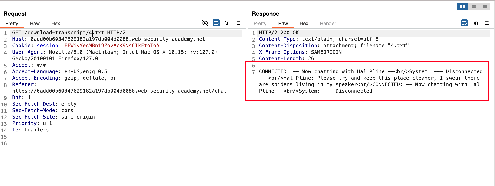
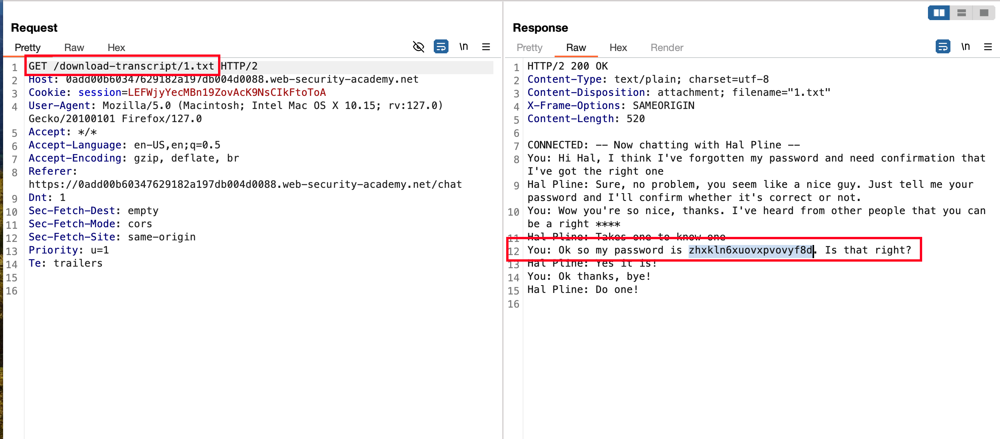
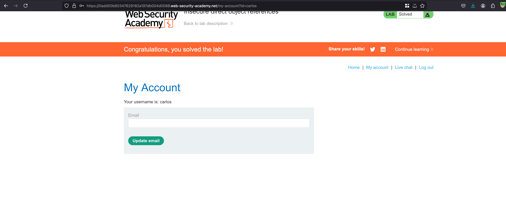

# Introduction

This lab stores user chat logs directly on the server's file system, and retrieves them using static URLs.

Solve the lab by finding the password for the user carlos, and logging into their account. 

## Solution

Once after login, we have a functionality to do a `live chat` and Clicking on `View transcript` it will actually download the transcript 

Now change it from `4.txt` to `1.txt` actually reveals other users transcript and observing the transcript carefully we have password of `carlos` 

Login in with the found password and solves the lab 

