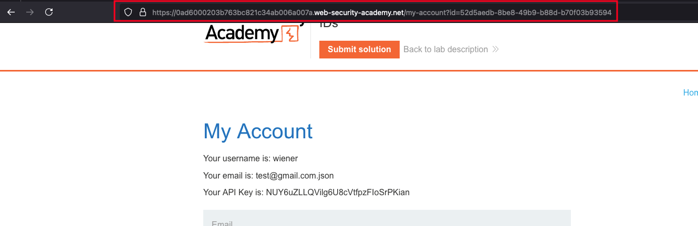
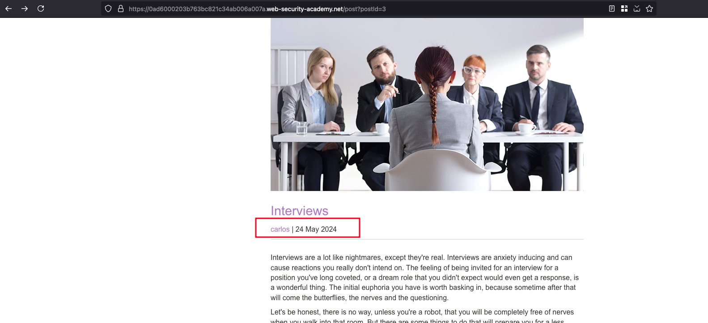
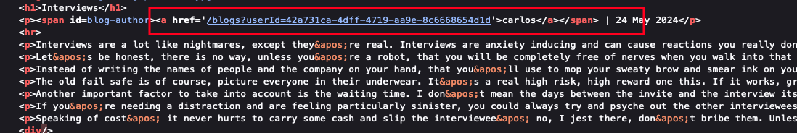
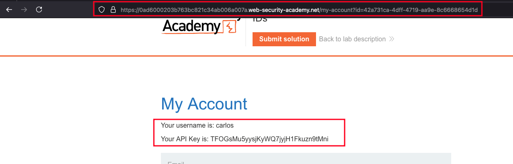
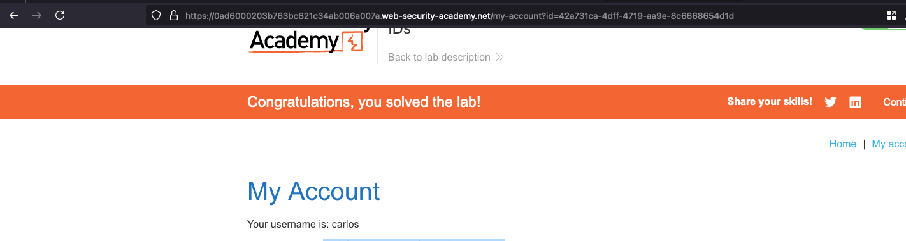

## Introduction 

This lab has a horizontal privilege escalation vulnerability on the user account page, but identifies users with GUIDs.

To solve the lab, find the GUID for carlos, then submit his API key as the solution.

You can log in to your own account using the following credentials: wiener:peter 

## Solution

Once after login with the credentials provided in the lab description and my account is identified through GUID 

Since it is GUID, we can't predict just like the previous on how simple it is and in this lab, we need to find a way to get GUID of carlos 

This is a blog forum right, while going through all the post but I found a post which was written by `carlos` called `Interviews`

Looking into source of the post, where we can find the GUID of carlos being leaked over there 

Now will go back to `My Account` and replace `id` parameter value with the following value `42a731ca-4dff-4719-aa9e-8c6668654d1d` where get the details of carlos

Submit the API key as solution and lab will be solved 

