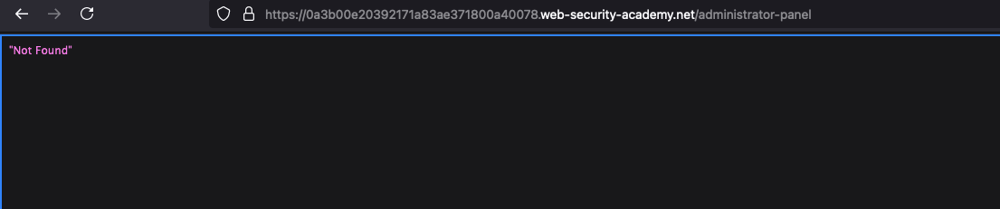
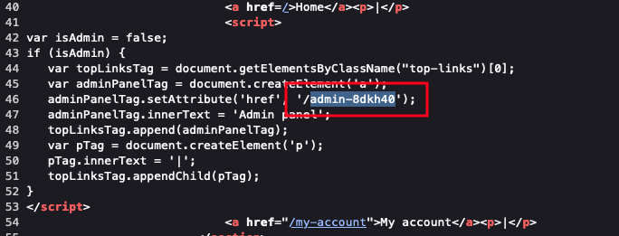
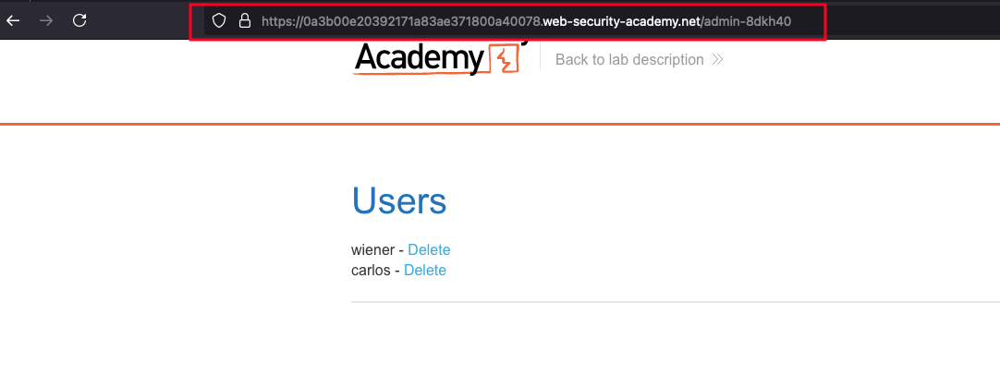
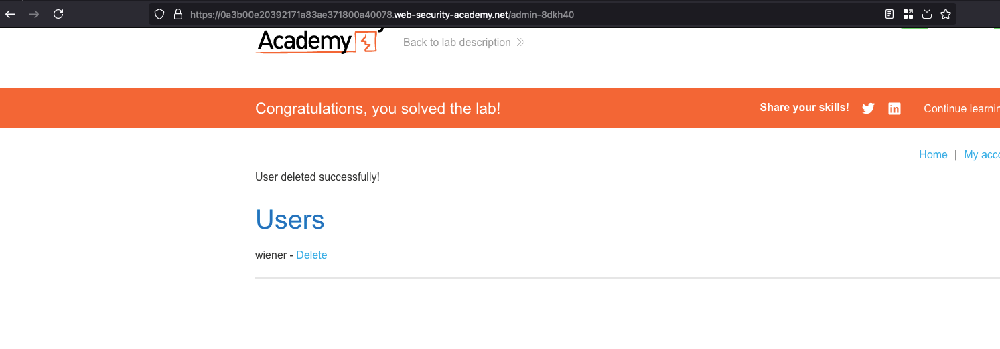

## Introduction 

This lab has an unprotected admin panel. It's located at an unpredictable location, but the location is disclosed somewhere in the application.

Solve the lab by accessing the admin panel, and using it to delete the user carlos. 

## Solution

Just looks like the previous lab, but accessing the same admin panel under `/administrator-panel` shows a `404` here means it is `Not Found`

Looking into the page source, we found a different endpoint called `/admin-8dkh40` inside a `isAdmin` javascript function 

Now accessing the following path `/admin-8dkh40` shows the complete admin panel 

Deleting the user called `carlos` will solve the lab 

