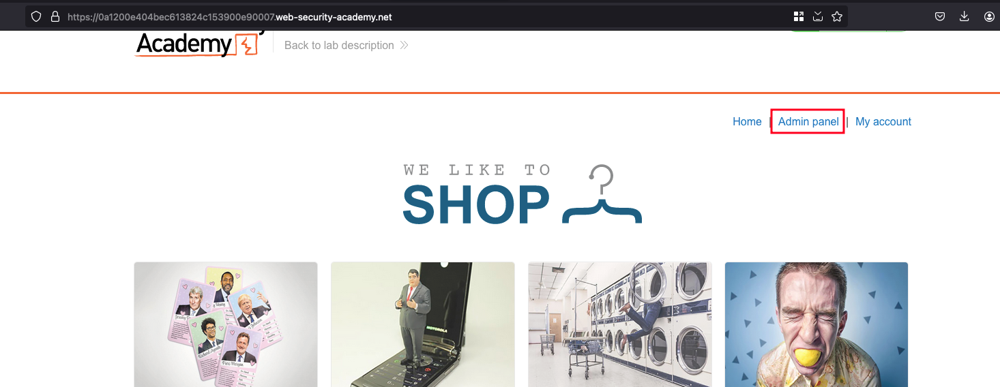
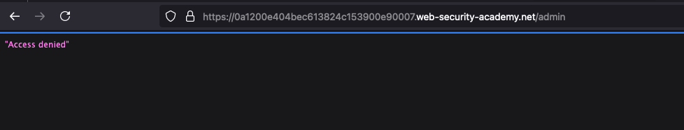
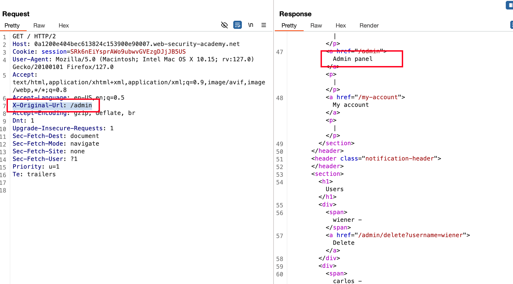
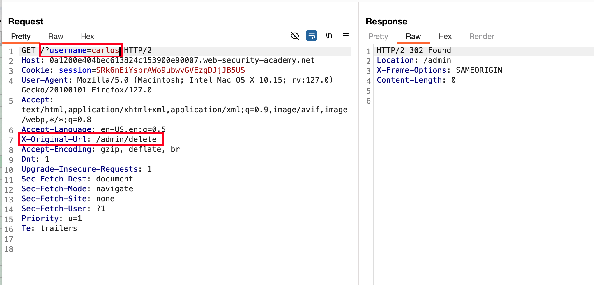

## Introduction 

This website has an unauthenticated admin panel at /admin, but a front-end system has been configured to block external access to that path. However, the back-end application is built on a framework that supports the X-Original-URL header.

To solve the lab, access the admin panel and delete the user carlos. 

## Solution

As mentioned in the lab objective, we have exposed admin panel which can be accessible through the following path `/admin` or you can click directly on the `Admin panel` tab available in the lab itself

Accessing the admin panel, But it says `Access denied`

Intercept the request in burpsuite, send it to repeater and add the following header called `X-Original-Url:` with the value sets as `/admin` and Once after sending the request, response shows that we are now able to access the admin panel 

Now the sent the following request as shown in image below which will delete the user called the `carlos` and lab is solved 

