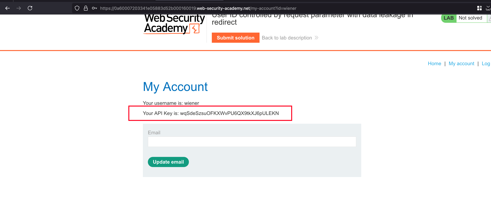
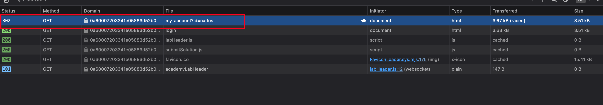
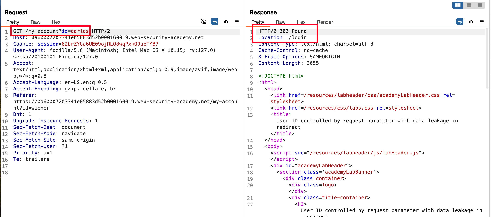
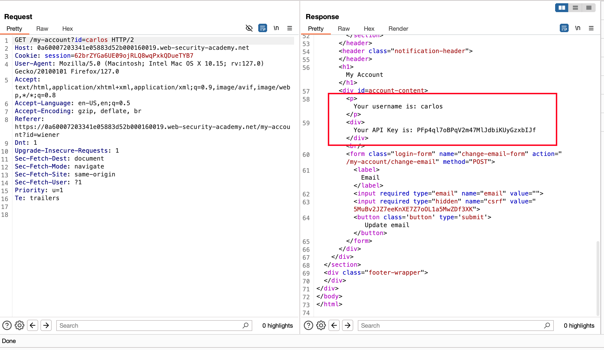
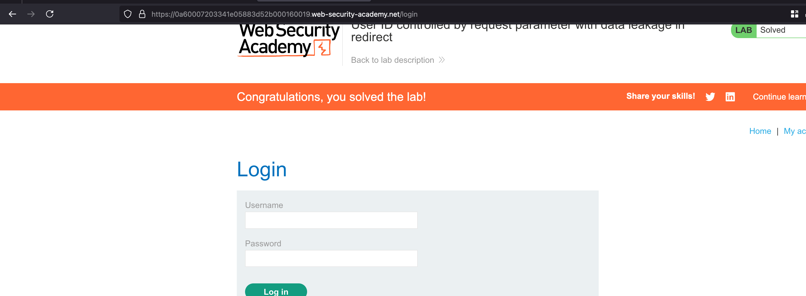

## Introduction 

This lab contains an access control vulnerability where sensitive information is leaked in the body of a redirect response.

To solve the lab, obtain the API key for the user carlos and submit it as the solution.

You can log in to your own account using the following credentials: wiener:peter 

## Solution 

With the following credentials they have provided `wiener:peter` and observe that each user may have a API key 

In the browser, if you observe closely on the parameter and their values where we have `?id=wiener` and changing it to `carlos` and redirects directly to the login page 

But the same above method reproduced in burp's repeater actually leaks the carlos API key in the and also redirects to `login page` 

We can also find the `carlos` API key in the same above response

Copy and paste the API key as a solution and lab will be solved 

This works due to the fact in the browser we have client-side checks where as through burp it is bypassed now 