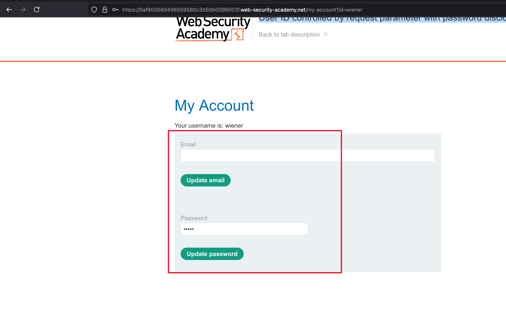
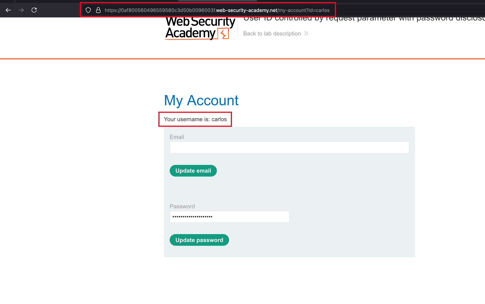
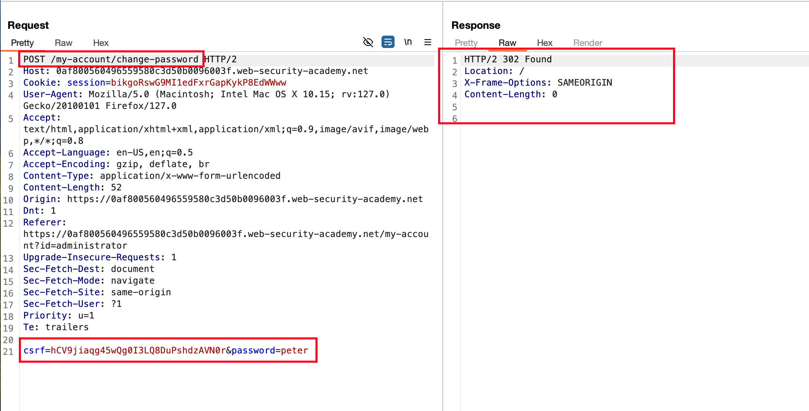
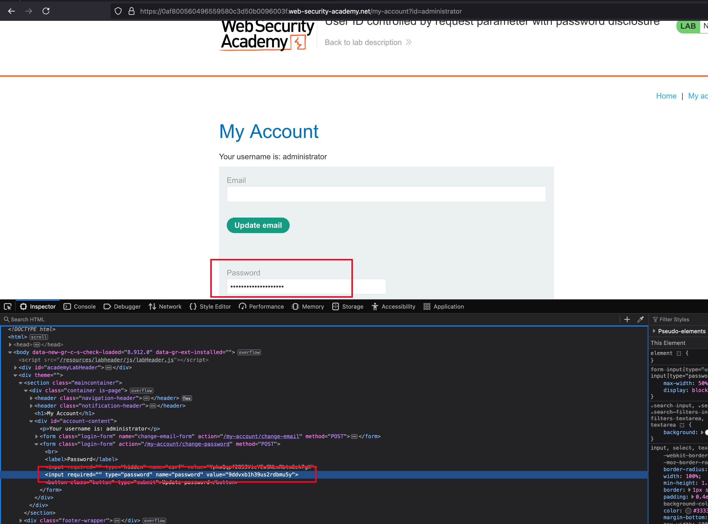
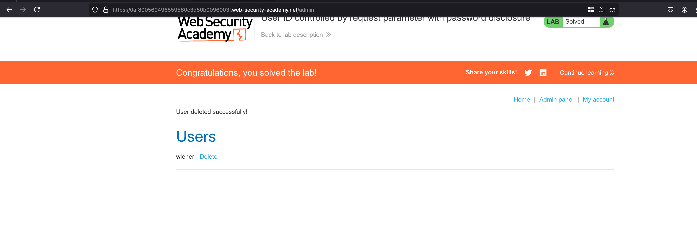

## Introduction

This lab has user account page that contains the current user's existing password, prefilled in a masked input.

To solve the lab, retrieve the administrator's password, then use it to delete the user carlos.

You can log in to your own account using the following credentials: wiener:peter 

## Solution

Once after login, we have a functionality to update both password and emails of a particular account 

But observing the parameter and value after login, we can see that `?id=wiener` and changing to `?id=carlos` also showcases the profile updation page of user called `carlos` and it shows IDOR vulnerability 

But our endgoal is to change the password of administrator and updated the password... Showcases a 302 redirect here

Logging in with the updated password, we can't able to login because password didn't get updated and I fall into a rabbit hole here 

What I did was, changed the `id` to `administrator` it shows masked password and checking the source page reveals password of admin

With the password, we have from the source, login into the admin account and go to the `Admin panel` then delete the user called `carlos` and lab is solved 

