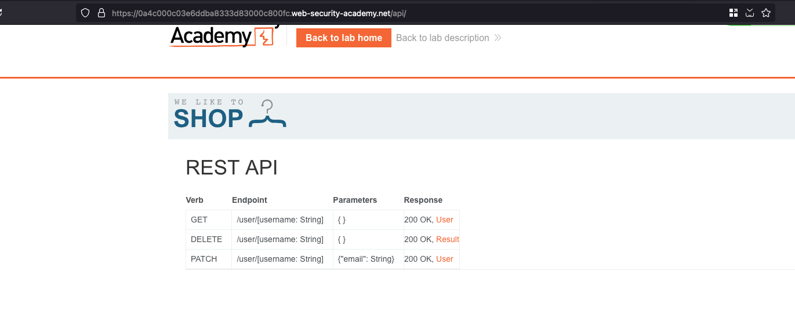
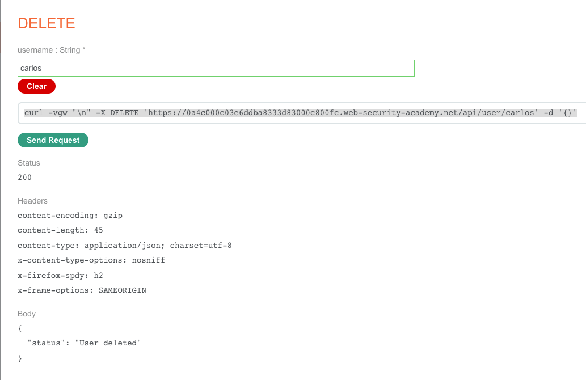

## Objective 

To solve the lab, find the exposed API documentation and delete carlos. You can log in to your own account using the following credentials: `wiener:peter`

## Solution 

Once after login with the credentials provided: `wiener:peter` accessing the path `/api` shows that there is a API documentation being available over there 



In order to solve the lab, we need to delete the user called `carlos` and for that, just select the `DELETE` and enter the username as `carlos` and where it will generate the following curl command 

```sh
curl -vgw "\n" -X DELETE 'https://0a4c000c03e6ddba8333d83000c800fc.web-security-academy.net/api/user/carlos' -d '{}'
```

And click on `Send Request` and API call goes through and show the `User deleted` and we solved the lab 

