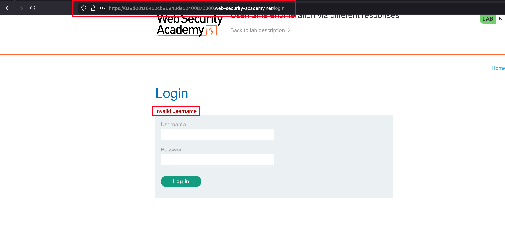
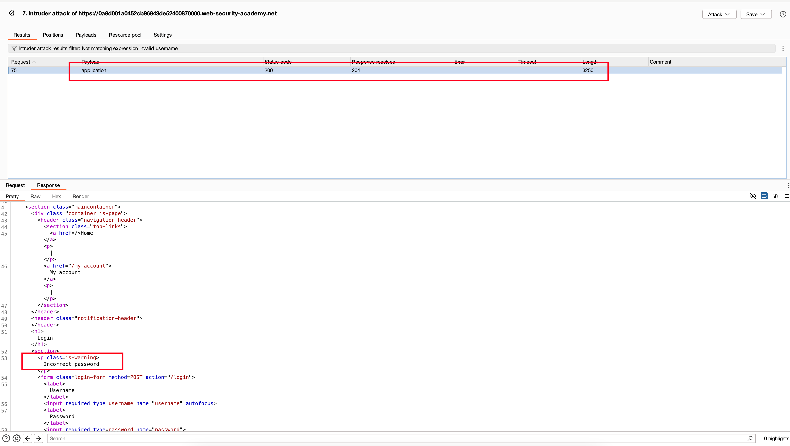
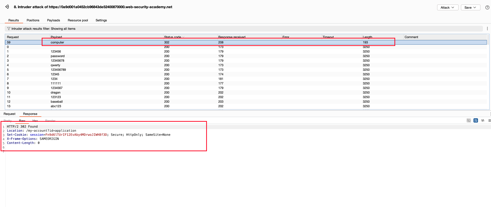
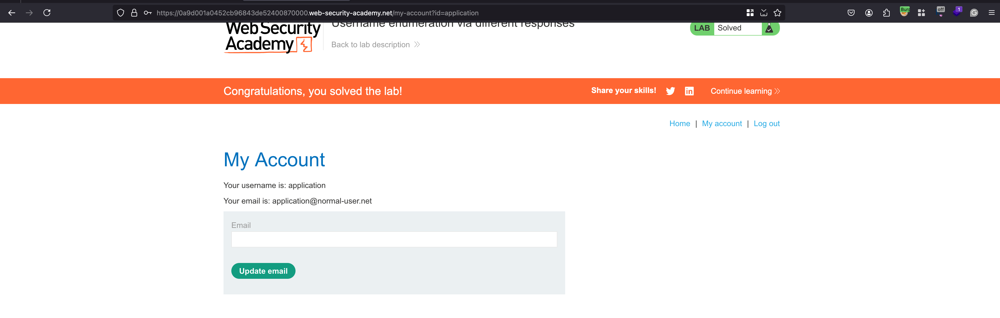

## Introduction

This lab is vulnerable to username enumeration and password brute-force attacks. It has an account with a predictable username and password, which can be found in the following wordlists:

**Candiate Username List:** https://portswigger.net/web-security/authentication/auth-lab-usernames
**Candiate Password List:** https://portswigger.net/web-security/authentication/auth-lab-passwords

To solve the lab, enumerate a valid username, brute-force this user's password, then access their account page. 

## Solution 

Entering some random username and password resulted in the response says that `Username is Invalid`

Now the username wordlist we do have, Intercepted the above request in burp, sent it to intruder, then bruteforced the `username` field and guess what we found the correct username which is `application` 

It isn't finished here and you can observe the above response where it is says `Incorrect password`

Repeater the same method again but for the password field with username as `application` and bruteforced the password field and found the field password as `computer` 

Sometimes the lab may get solved automatically and here it didn't go that way.. Where I need to login with the found username and password then lab is solved

