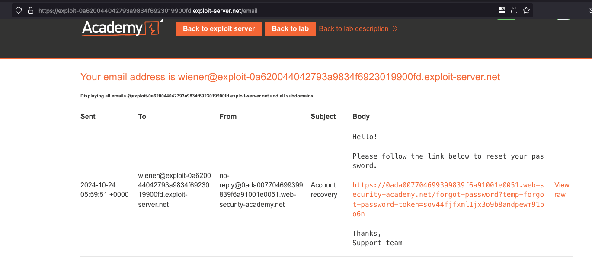
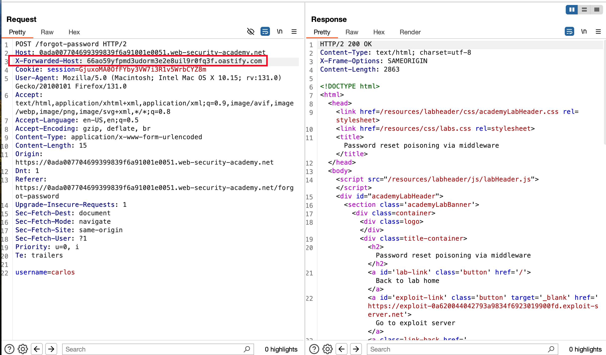
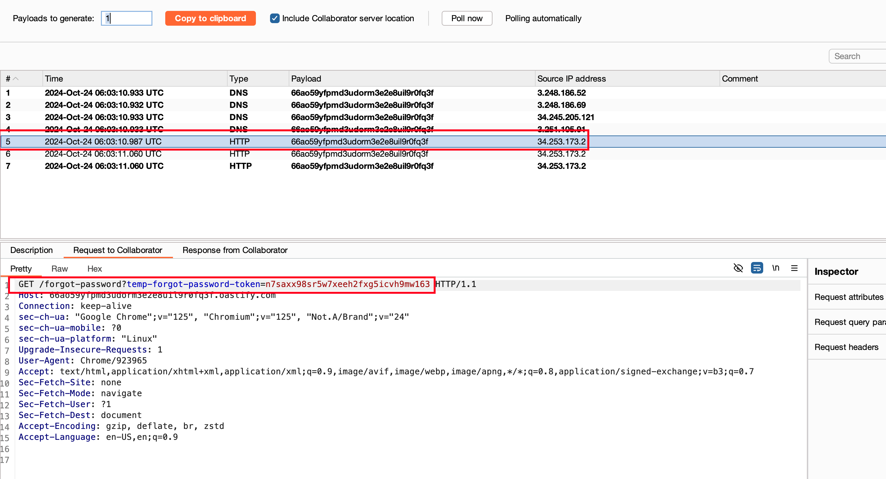
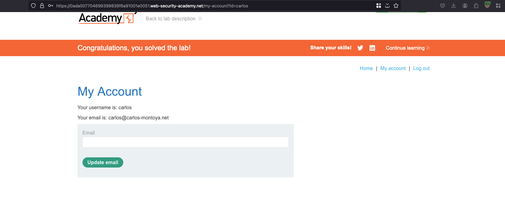

## Objective 

This lab is vulnerable to password reset poisoning. The user carlos will carelessly click on any links in emails that he receives. To solve the lab, log in to Carlos's account. You can log in to your own account using the following credentials: wiener:peter. Any emails sent to this account can be read via the email client on the exploit server. 

## Solution 

To check on how the password reset flow works, we can initiate the forgot password request and set the username to `wiener` which is the user we own 

Checking the email client on the exploit server, recieved the forgot password URL 

Using paraminer, Fuzzed the following request and found out there is new header exist which is `X-Forwarded-Host` and Through that header we sent the payload as collaborator URL 

Checking the collaborator pingbacks, we have recieved the password reset token for carlos 

Construct the full URLs like this `/forgot-password?temp-forgot-password-token=n7saxx98sr5w7xeeh2fxg5icvh9mw163` and reset the password for the `carlos` user 

Now login the user and password you updated... that solves the lab 

