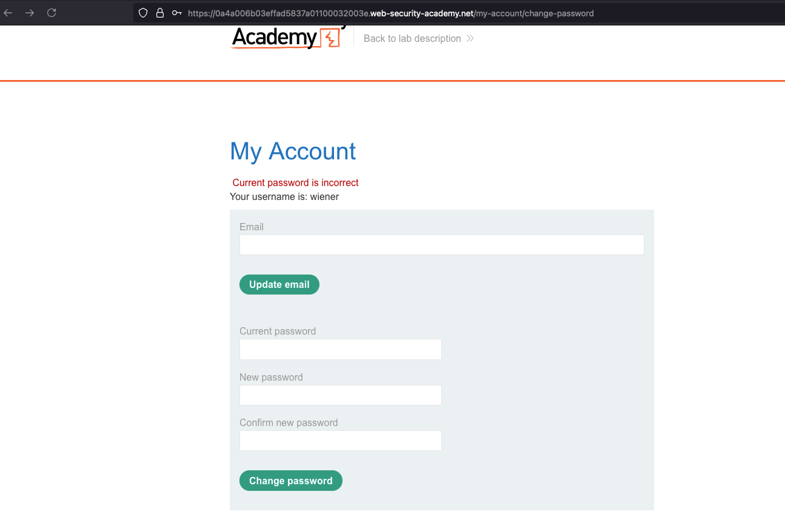
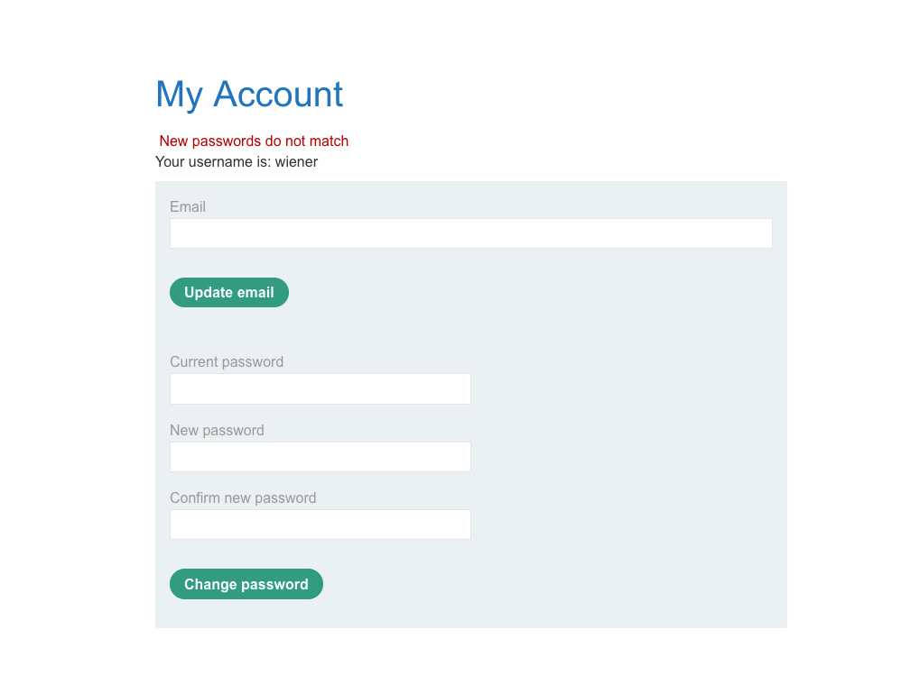
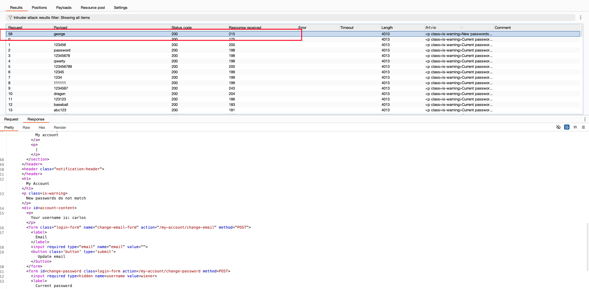

## Objective 

This lab's password change functionality makes it vulnerable to brute-force attacks. To solve the lab, use the list of candidate passwords to brute-force Carlos's account and access his "My account" page. 

## Solution 

If we enter the wrong password, the response says that the current password is incorrect 

So when we enter the correct password, the new password, and the confirmed password (if it's different). The response is different. 

Let's bruteforce the current password field through intruder... but based on response filter where we saw initially on `new password` and `confirm new password` and as it makes a error like `New password is incorrect` 

Now after bruteforce is completed and we found that the password for carlos user is `george` 

Log in as `carlos` user with password as `george` and that solves the lab 

