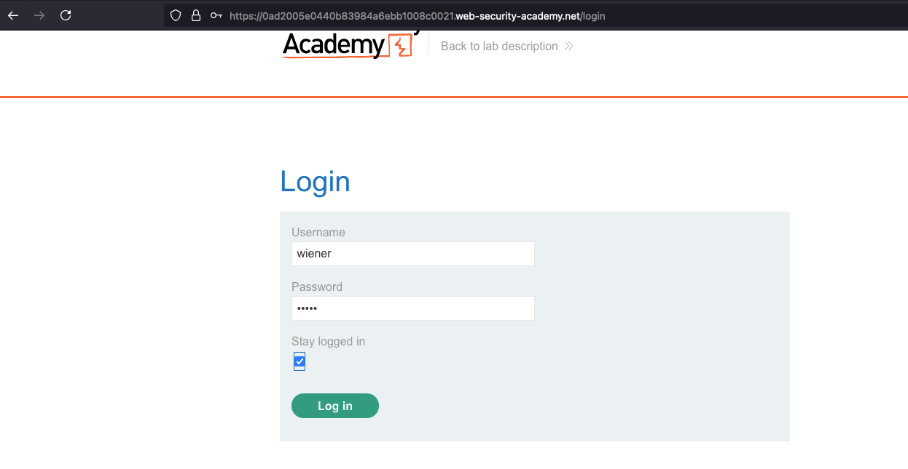
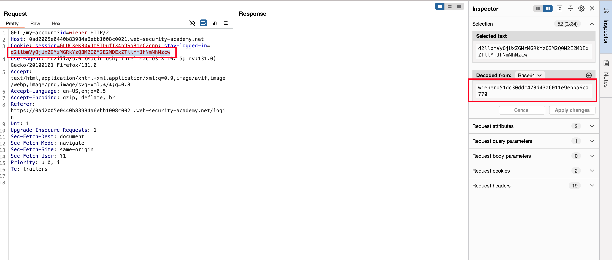
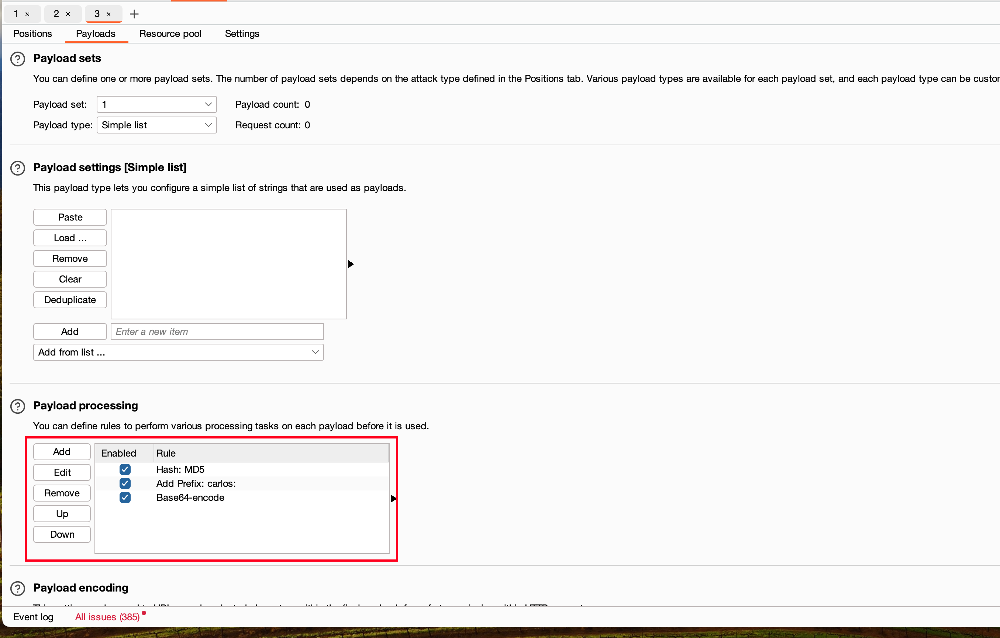
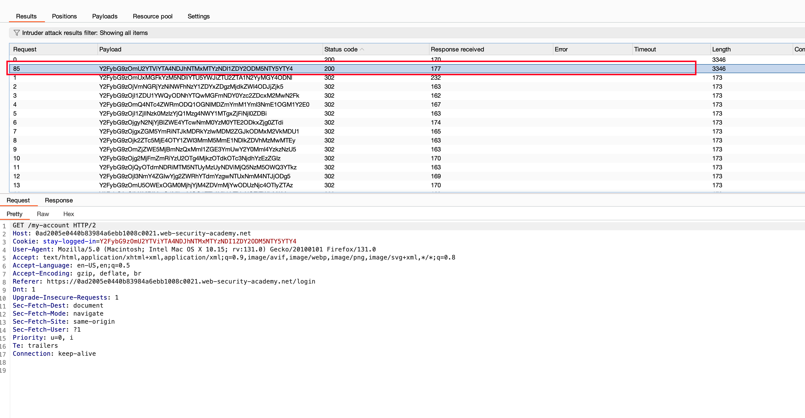
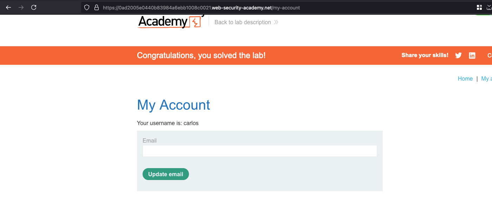

## Objective 

This lab allows users to stay logged in even after they close their browser session. The cookie used to provide this functionality is vulnerable to brute-forcing.

To solve the lab, brute-force Carlos's cookie to gain access to his "My account" page.
- Your credentials: wiener:peter
- Victim's username: carlos
- Candidate passwords: https://portswigger.net/web-security/authentication/auth-lab-passwords

## Solution 

While logging in, we do have functionality called `Stay loggedin` kind of like even after you close the browser it's still being loggedin 

Post login, we can observe that there is a cookie value called `stay-logged-in` which is in form of `base64` with the combination of `username:password` but the password is hashed in `MD5` format

Now send the intercepted request to intruder and set the placeholder for `stay-logged-in` cookie and setup the payload processor like this that's how we decoded it right 

- We are setting up hashing format for MD5 where each password from the wordlist gets converted into MD5 format  
- Setting up the prefix for the victim username which is carlos
- Finally combining it and encoding it in a base64 format

Once after starting the bruteforce attack, observed there are alot `302` kinda redirects out there but one specific with request on `85` have a status code `200` and a different length 

Opening the response in the browser, we got loggedin as `carlos` user and that solves the lab 

