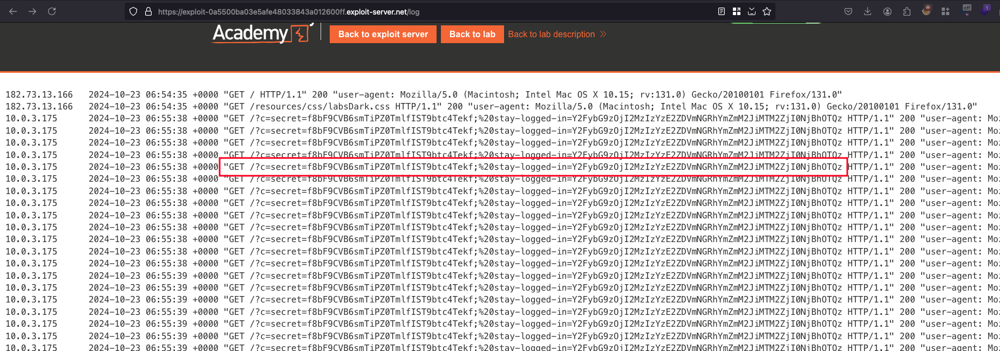
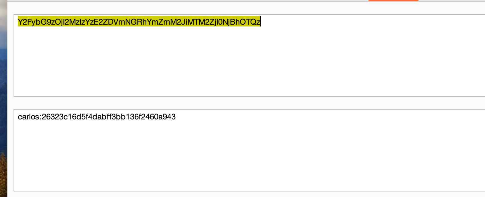
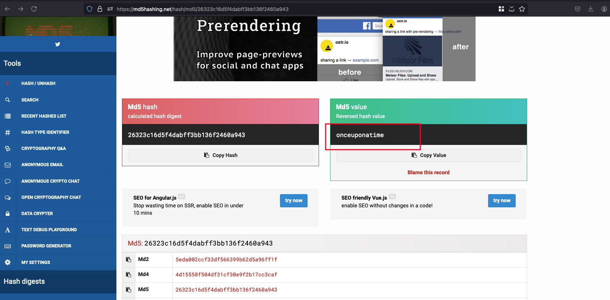
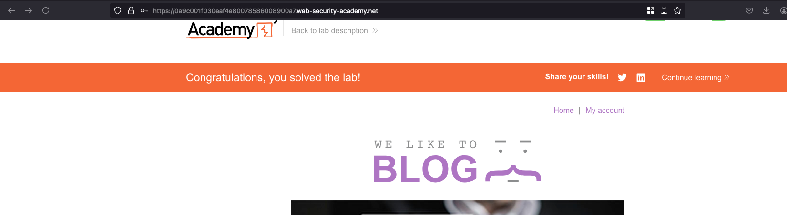

## Objective 

This lab stores the user's password hash in a cookie. The lab also contains an XSS vulnerability in the comment functionality. To solve the lab, obtain Carlos's stay-logged-in cookie and use it to crack his password. Then, log in as carlos and delete his account from the "My account" page.

- `Your credentials:` wiener:peter
- `Victim's username:` carlos

## Solution 

Going through the lab objective, we know that there is XSS vulnerability exists and what we did his.. filled up all the details in post and in the comment field, instead of adding the some random text but we entered the following payload `` and posted the comment 

Checking the Access log through the exploit server, we found the following cookies value 

Now let's copy the `stay-logged-in` cookie value and decoded it in a base64 format and found that this cookie belongs to `carlos` user just like the previous lab and suprisingly the password is also in MD5 hash format 

Decrypted MD5 hash and password will be `onceuponatime` 

Now login into `carlos` user with password as `onceuponatime` that solves the lab 

