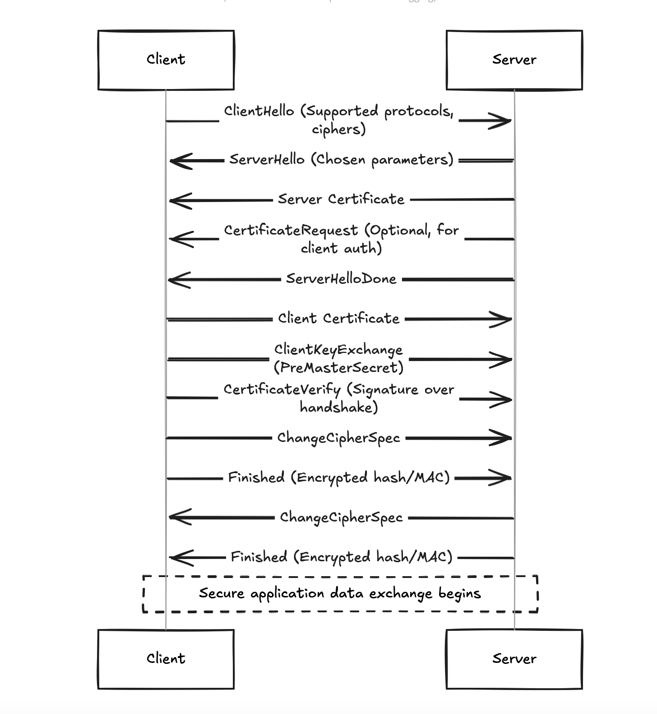

---
author: Nithissh S
pubDatetime: 2025-01-04T11:22:00Z
modDatetime: 2025-01-04T11:22:00Z
title: Understanding Client Certificate Authentication and the TLS Handshake
slug: client-cert
featured: false
draft: false
tags:
  - Client Authentication
description:
  A detailed dive into client certificate authentication, its role in the TLS handshake, and how it adds an extra layer of security in sensitive communications.
--- 

## Overview  

Client certificates serve as a mechanism for identifying and authenticating users or devices to a server. These certificates are digital files, often password-protected, and are commonly loaded into applications in the form of `.p12` or `.pfx` files.  

Authentication using client certificates is a part of the SSL/TLS handshake, which establishes a secure communication channel before data transmission begins.  

## SSL/TLS Handshake Process  

During an SSL/TLS handshake, both the client and server exchange security-related information to establish a secure communication channel. Below is a high-level explanation of the handshake:  

1. **ClientHello:** The client sends its supported algorithms and ciphers.  
2. **ServerHello:** The server responds with its chosen parameters and sends its certificate for authentication.  
3. **(Optional) Client Certificate Authentication:** If the server is configured to require a client certificate, it requests one at this stage. The client sends its certificate and proves ownership using its private key.  
4. **Key Exchange and Verification:** Both parties establish session keys for encryption.  
5. **Finished Messages:** Secure communication begins after verifying integrity.  

## Client-Authenticated TLS Handshake in Detail  

The following diagram illustrates the full process of a client-authenticated TLS handshake:  

## Key Phases of the Handshake  

### Negotiation Phase  

- **ClientHello:** Client proposes protocol versions, ciphers, and random values.  
- **ServerHello:** Server confirms parameters and provides its certificate.  
- **Certificate Request:** Server may optionally request a client certificate for mutual authentication.  

### Authentication Phase  
- **Client Certificate:** The client sends its certificate to prove its identity.  
- **CertificateVerify:** A signature over previous handshake messages is sent, proving the client owns the private key.  

### Key Exchange and Cipher Setup  
- **Key Exchange:** Both client and server derive a "master secret" from exchanged values.  
- **ChangeCipherSpec:** Signals that subsequent messages will be encrypted.  

### Application Phase  
- Once the handshake is complete, secure data transmission begins, with messages encrypted and authenticated.

## Importance of Client Certificate Authentication  

While server certificate authentication is commonplace, client certificates add an additional layer of security by verifying the client's identity. For this validation to succeed:  

- The client certificate must be signed by a Certificate Authority (CA) trusted by the server.  
- The client must prove ownership of the certificate by using its private key during the handshake.  