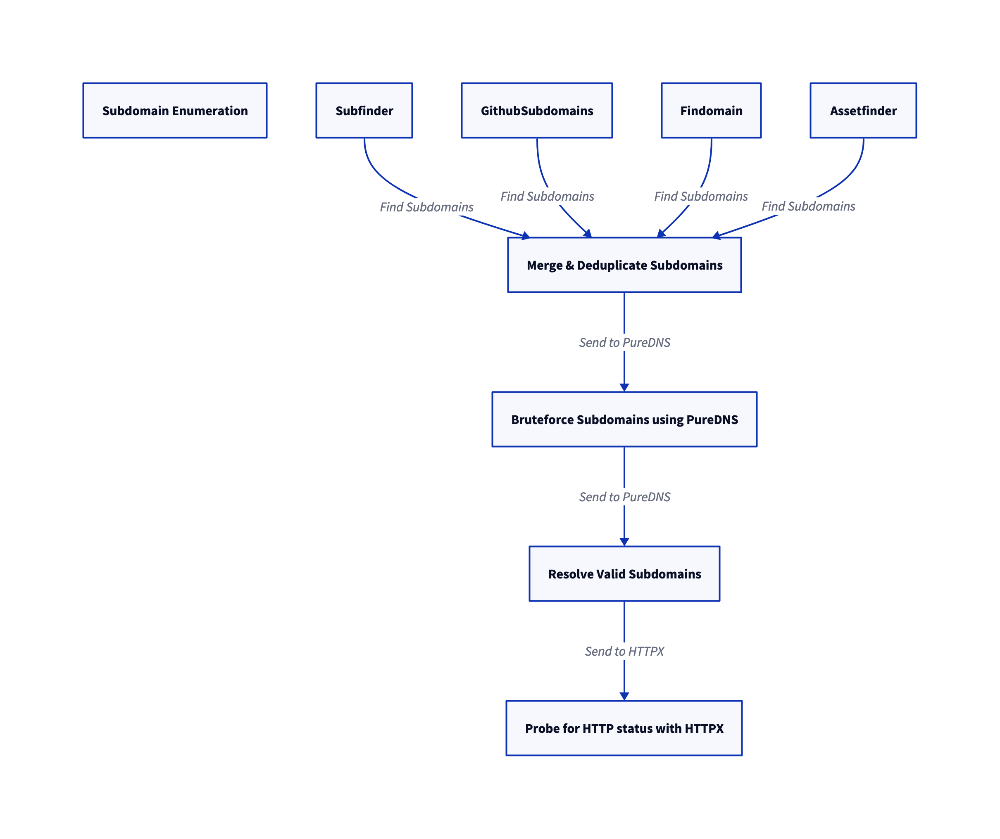

## Introduction 

Hi folks, I hope everyone is doing great!

One mid-afternoon during work, I found some time to dive into bug bounty hunting. Unlike many others, I don’t usually work on platforms like HackerOne, Intigriti, or Bugcrowd. Instead, I rely on Google dorking to discover potential targets. This time, I came across a target with a promising scope and broad functionality to test.

But there’s a twist! I’m not sure if they’ll respond. Some companies host bug bounty programs but tend to stay silent, leaving submissions unanswered. In such cases, I avoid fully committing to the target initially. Instead, I focus on identifying and submitting low-hanging bugs first. Then, I wait for the team’s response before investing more time into deeper testing.

<div style="width:100%;height:0;padding-bottom:100%;position:relative;"><iframe src="https://giphy.com/embed/VbE1xtnPHx6D34GXhv" width="100%" height="100%" style="position:absolute" frameBorder="0" class="giphy-embed" allowFullScreen></iframe></div><p><a href="https://giphy.com/gifs/outlander-tv-season-5-starz-VbE1xtnPHx6D34GXhv"></a></p>

So, the first thing I did was go through their bug bounty policy. They explicitly mentioned that everything under the wildcard `*.example.com` was in scope. Without wasting any time, I jumped right into subdomain enumeration.  

To cover as much ground as possible, I used a combination of tools and techniques:  

1. **Subdomain Enumeration**:  
   - **Tools Used**: `subfinder`, `amass`, `assetfinder`, `crobat`, `github-subdomains`, and `findomain`.  
   - These tools helped me gather a comprehensive list of subdomains associated with the target.  

2. **Subdomain Bruteforcing**:  
   - **Tools Used**: `puredns` with the combined power of **jhaddix's `all.txt` wordlist** and **Assetnote's `best-dns-wordlist`**.  
   - This step ensured I could discover any hidden or less-obvious subdomains.

3. **Subdomain Alteration**:  
   - **Tools Used**: `DNSCewl` and `puredns`.  
   - This technique involved manipulating and generating variations of known subdomains to uncover potential vulnerabilities.  

Finally, I used `puredns` to resolve the results and filter out any inactive subdomains. This approach gave me a solid foundation to start exploring the target.

## Recon flow 



## After Recon 

Then, using the same httpx we can do many things. Like looking for the status codes and titles. But it doesn’t seem to be any interesting. 

Then I started the directory Bruteforce using dirsearch on 404, 403 pages. Here there are some results but most of them false positives. On the other hand in the screen command, I started the nuclei for the list of probed domains aside But After Analyzing the result from nuclei . There is no high , low , medium , critical vulnerabilities. 

But in info , the subdomain has a hidden ec2 instances In other Words , Nuclei detects as EC2 detection . So, At first I thought it was a false positive later on I manually inspected the source code and I found that EC2 instances were there in the source code

When Visiting the Hidden EC2 instances from the source code , It gave me 403 Forbidden.

<div class="tenor-gif-embed" data-postid="14785562" data-share-method="host" data-aspect-ratio="1.66667" data-width="100%"><a href="https://tenor.com/view/4chan-404forbidden-403forbidden-404girl-anime-gif-14785562">4chan 404forbidden GIF</a>from <a href="https://tenor.com/search/4chan-gifs">4chan GIFs</a></div> <script type="text/javascript" async src="https://tenor.com/embed.js"></script>


## Enumerate the 403: Guess What?

Ever stumbled upon a **403 Forbidden** or **404 Not Found** error while browsing a webpage? It’s frustrating, right? But for a security enthusiast, these errors can be intriguing entry points. One common approach I use to investigate further is **Directory Fuzzing**—and in this case, I used **Dirsearch**, a popular tool for directory enumeration.

### Step 1: Fuzzing the Target Directory

I started by running the following Dirsearch command:

```bash
dirsearch -e conf,config,bak,backup,swp,old,db,sql,asp,aspx,py,rb,php,tar,log,txt,json,xml,zip -u https://target
```

This command scans the target URL with a wide range of file extensions such as `conf`, `bak`, `sql`, `php`, `json`, and more, which are commonly exposed by misconfiguration.

Interestingly, Dirsearch hit upon a **200 OK** response for the `/app` directory, but when I visited the URL directly, it gave me a blank page. Not giving up, I decided to go deeper and launched another round of Dirsearch on the discovered `/app` path.

### Step 2: Digging Deeper

Now, I updated my Dirsearch scan to focus on the `/app` directory:

```bash
dirsearch -e conf,config,bak,backup,swp,old,db,sql,asp,aspx,py,rb,php,tar,log,txt,json,xml,zip -u https://target/app
```

This time, I struck gold: **/app/customer.csv** was discovered. Upon visiting the URL, the file was downloaded to my system.

### Step 3: Jackpot! Sensitive Data Found

Opening the `customer.csv` file revealed something that should never be publicly accessible—**Personal Identifiable Information (PII)**, including **user credentials**, **credit card details**, and other sensitive customer information. 


## Conclusion

On **02/10/2021**, I reported this issue to the program, and by **03/10/2021**, the bug was accepted. Just a day later, on **04/10/2021**, the team rewarded me with **20k INR** for the find.

As a tip for anyone exploring directory fuzzing: **Don’t stop at one path**, especially if it gives a blank or ambiguous response. Always go deeper—**fuzz the blank page**—you might uncover sensitive data or even more valuable information. Persistence is key in uncovering hidden vulnerabilities!