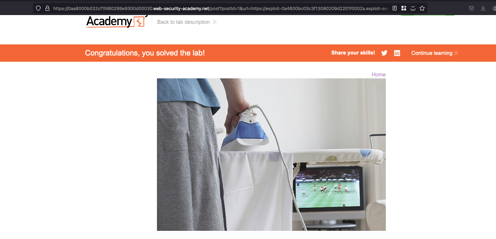

## Objective 

This lab contains a DOM-based open-redirection vulnerability. To solve this lab, exploit this vulnerability and redirect the victim to the exploit server. 

## Solution 

When exploring a particular blog post, looking into the bottom.. we have a clickable like `Back to Blog` once you click on it.. it redirects back to the home page 

Looking into source of the page, we found a javascript code 

```js
<div class="is-linkback">
    <a href="#" onclick="
        const returnUrl = /url=(https?:\/\/.+)/.exec(location);
        location.href = returnUrl ? returnUrl[1] : '/';
    ">Back to Blog</a>
</div>
```

This code extracts a URL from the current page's query parameters (using a regex) and redirects the user to it if found. If no valid URL is present, it defaults to redirecting the user to the homepage (/).

Then `url` parameter is user controllable and through that, we can pass our exploit server url like `&url=<exploitable_server>` and that solves the lab 

