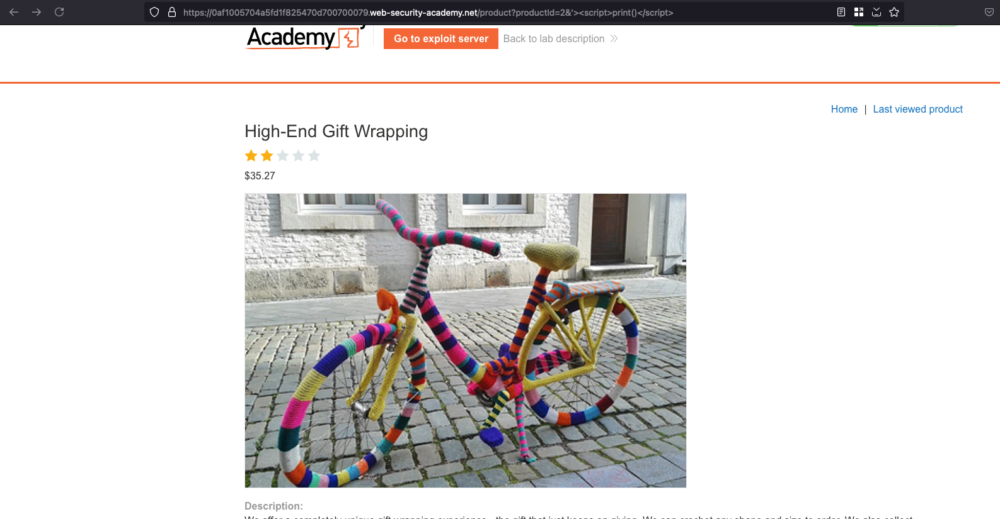
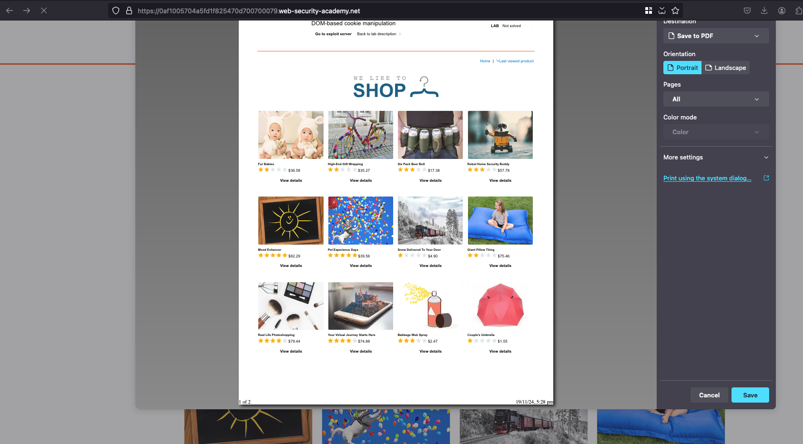
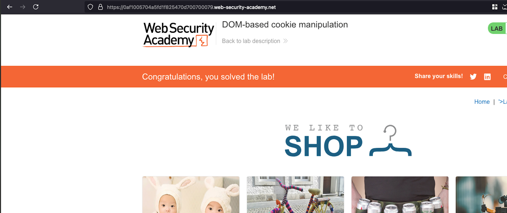

## Objective 

This lab demonstrates DOM-based client-side cookie manipulation. To solve this lab, inject a cookie that will cause XSS on a different page and call the print() function. You will need to use the exploit server to direct the victim to the correct pages. 

## Solution 

From the home tab, we have a functionality where you can view the `Last viewed product` and we can poison that via an XSS payload like here



Now click on the home page, the XSS payload will get triggered and shows a print option 



Now put it all together, we have constructed the following payload which will poison the particular product with an XSS and opens the home page.. where the XSS will execute 

```html
<iframe src="https://0af1005704a5fd1f825470d700700079.web-security-academy.net/product?productId=1&'><script>print()</script>" onload="if(!window.x)this.src='https://0af1005704a5fd1f825470d700700079.web-security-academy.net';window.x=1;">
```

Now through the exploit server, pass the payload and deliver the exploit to victim and that solves the lab 

