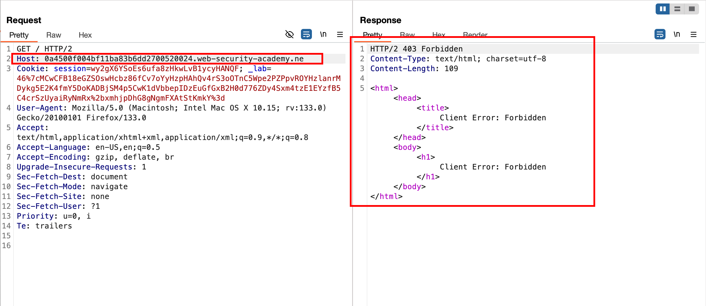
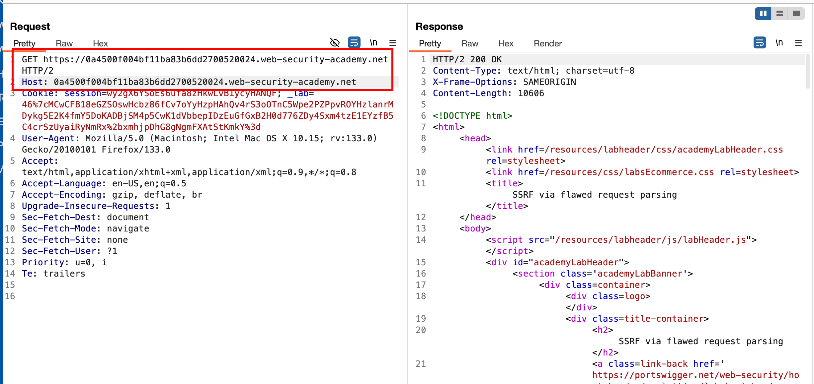
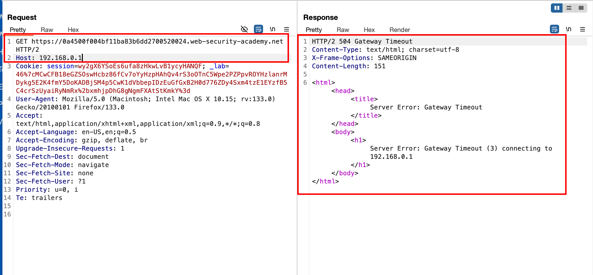
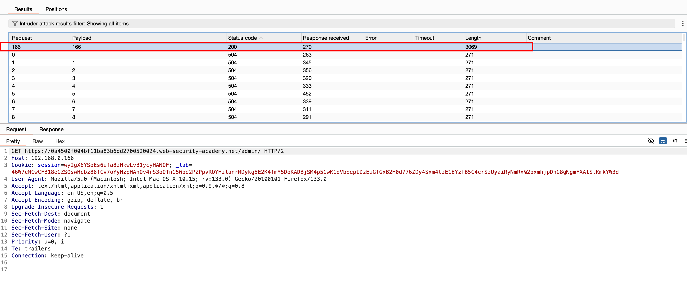
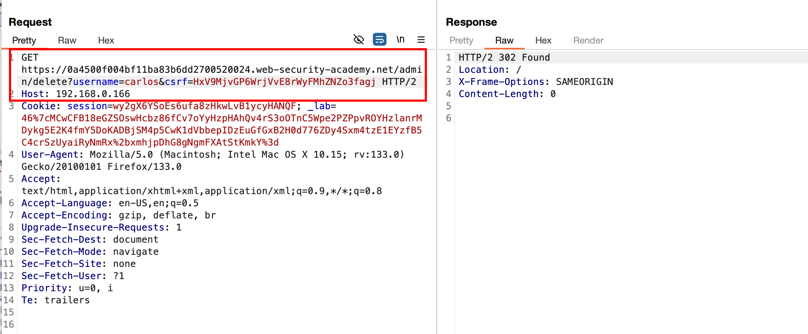
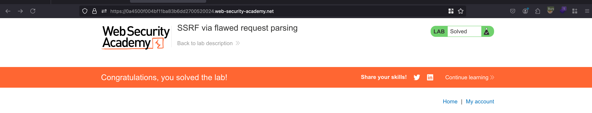

## Objective 

This lab is vulnerable to routing-based SSRF due to its flawed parsing of the request's intended host. You can exploit this to access an insecure intranet admin panel located at an internal IP address.

To solve the lab, access the internal admin panel located in the `192.168.0.0/24` range, then delete the user `carlos`. 

## Solution 

Just like the last lab, I checked on `Host` header whether we can able to control it but it isn't possible now.. when I changed the domain tld from `.net` to `.ne` got `403` error 

But when we change some thing like this... Request is valid and still works 

Let's keep everything the same from previous but let's change the host header from `Portswigger URL` to something like `192.168.0.1` recieves a `504 gateway error` just like the previous lab 

Exactly on the `166th` request, we just got a hit and it's status code of `200` means that we can get the admin panel now 

Now, we can initiate a delete request to delete the user called `carlos` and recieves a `302` response 

Just refresh the UI and the lab is solved on successful deletion of `carlos`

