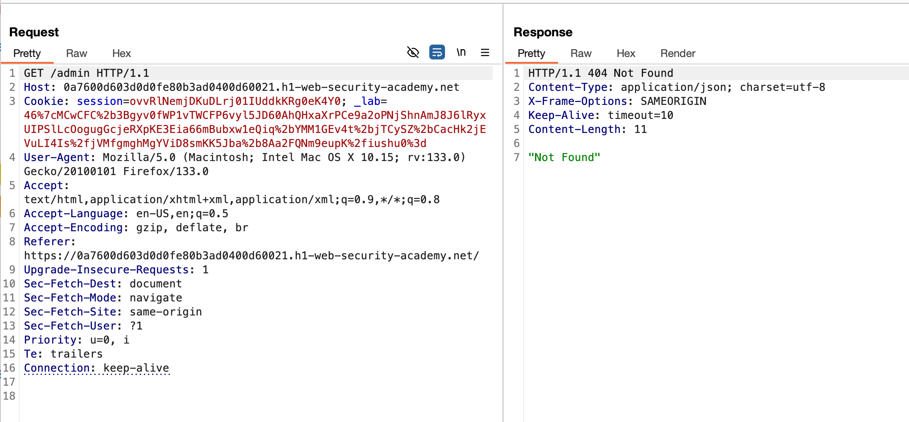
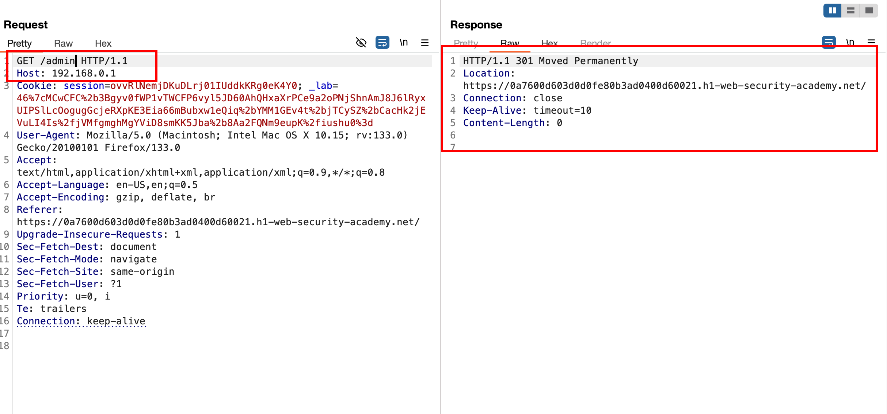
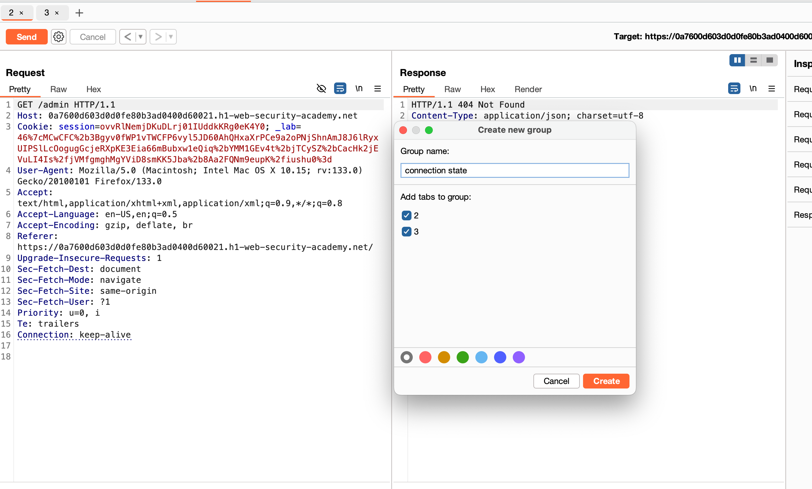
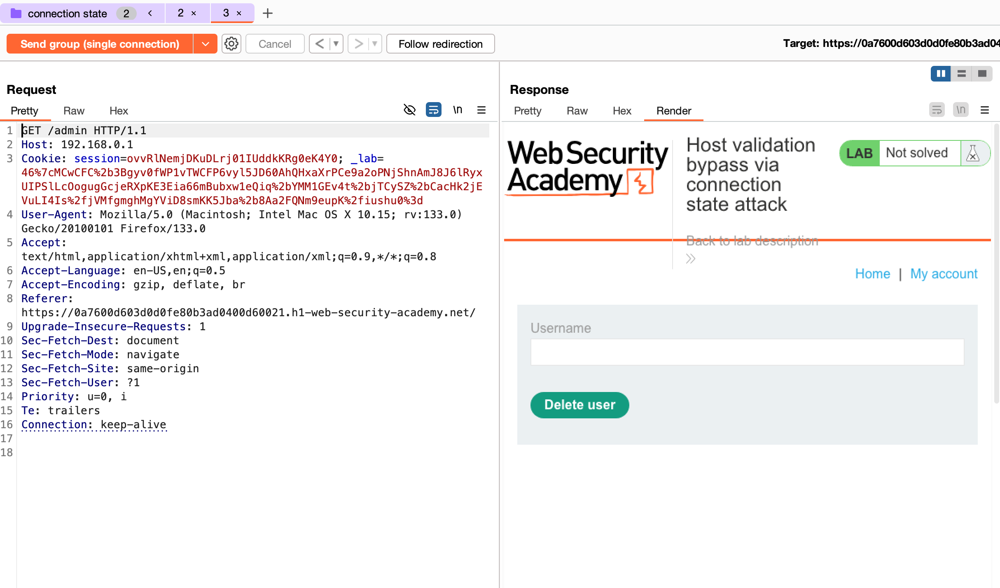
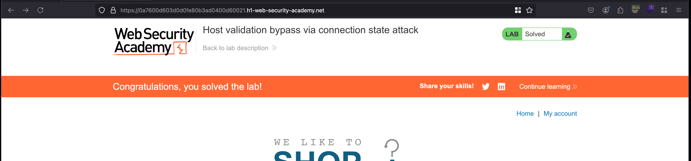

## Objective 

This lab is vulnerable to routing-based SSRF via the Host header. Although the front-end server may initially appear to perform robust validation of the Host header, it makes assumptions about all requests on a connection based on the first request it receives.

To solve the lab, exploit this behavior to access an internal admin panel located at `192.168.0.1/admin`, then delete the user `carlos`. 

## Solution

After spinning the lab and adding a path `/admin` doesn't workout and it says `404` and where they have mentioned it clearly it is routing based SSRF 

Ok what happens, when we replace it with the virtual host like `192.168.0.1` inside a `Host:` header and what happens is it gets redirected back to the original host header or to the lab one

Now after reading this blog mentioned in the lab objective which is [here](https://portswigger.net/research/browser-powered-desync-attacks#state) 

we can create a tab group, one is the normal lab URL which obviously hits `200` and other request his takes the virtual host `192.168.0.1` with path as `/admin`

Well as expected, the first request hits `200` and second request which is malicious one to access the `internal` server 

- This only works when sending it as groups 
- Because the very first request isn't malicious request rather it is valid one 
- Since the first request passes successfully in the connection stream and it will assume that the subsequent requests are valid ones and aren't legal

In order to solve the lab, we need to delete the user called `carlos` and for that we can initiate the request to the following endpoint `/admin/delete?username=carlos&csrf=HU0UDcpNewD3AcDeQqAnl9Ll5AiW16Ji` which will delete the user called `carlos` and lab is solved 

