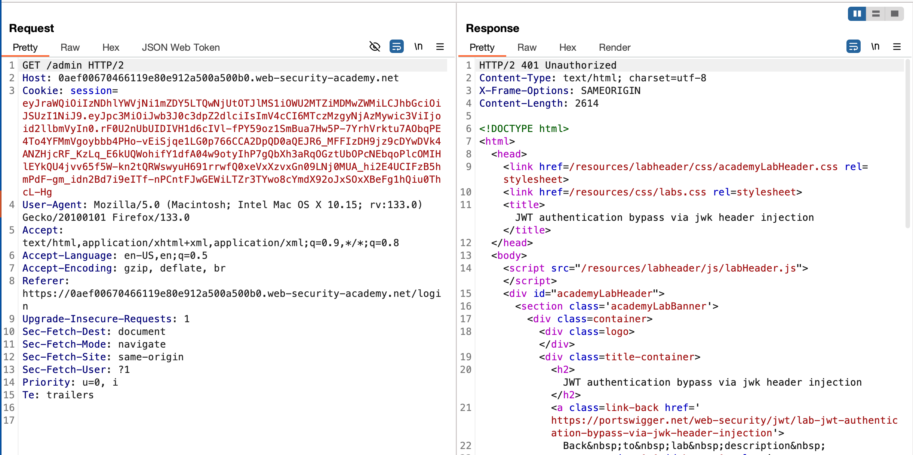
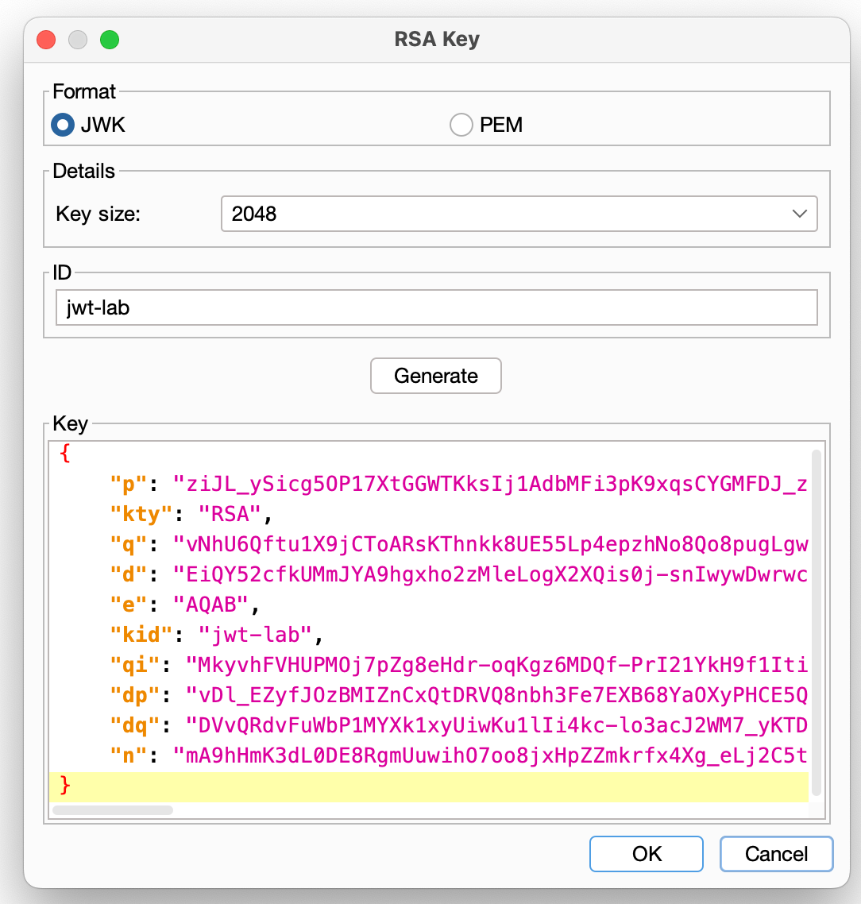
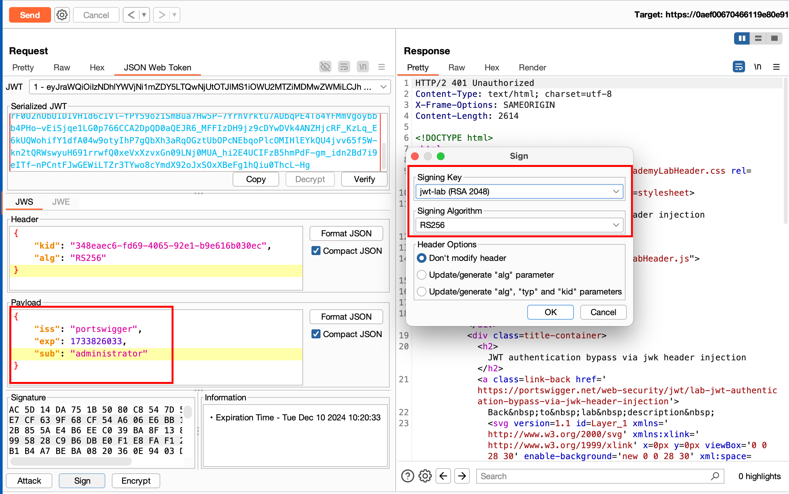
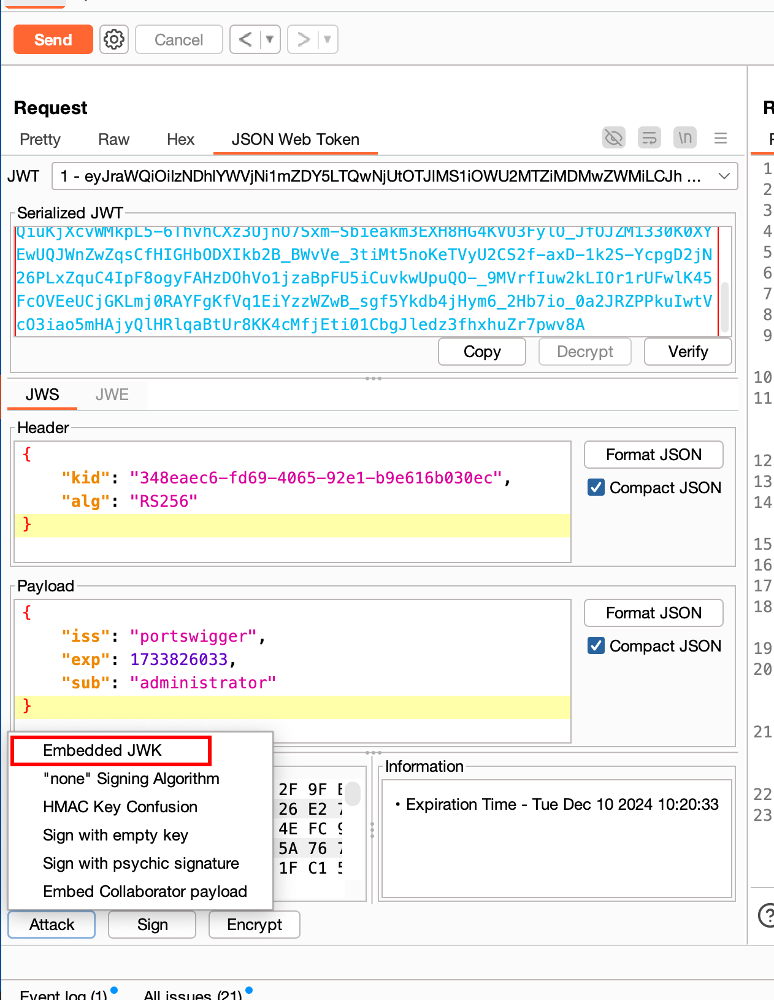
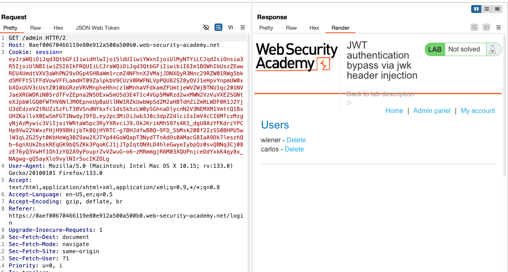

## Objective 

This lab uses a JWT-based mechanism for handling sessions. The server supports the jwk parameter in the JWT header. This is sometimes used to embed the correct verification key directly in the token. However, it fails to check whether the provided key came from a trusted source.

To solve the lab, modify and sign a JWT that gives you access to the admin panel at `/admin`, then delete the user carlos.

You can log in to your own account using the following credentials: `wiener:peter`

## Solution 

Accessing the admin panel through `/admin` results in an unauthorized error 

Now, before we can start exploitation.. we can install the extension called JWT-editor and once after installation, we can select the format as `JWK` in other terms which is JSON Web keys kind of a RSA keys

Now In the repeater tab, we can change it to `JSON Web token` and change the payload from `sub:wiener` to `sub:administrator` and then Click on signing key.. select the key which we created 

Then click on `Attack embedded JWK` what happens his when the Servers should only trust a specific set of public keys to verify JWT signatures. However, some servers are misconfigured and accept any key provided in the jwk parameter. But this vulnerability allows you to exploit it by creating a fake JWT, signing it with your own RSA private key, and including the matching public key in the jwk header.

Once after the attack is successful, we can send the request once again.. where it results in accessing the admin panel now through `/admin` 

Now we can just the delete the user called `carlos` and that solves the lab 

