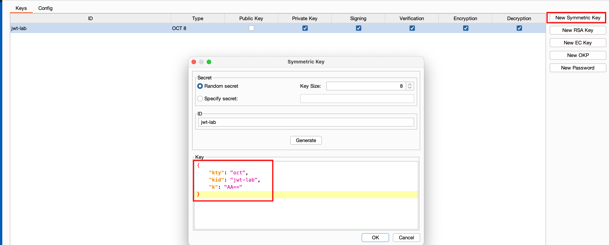
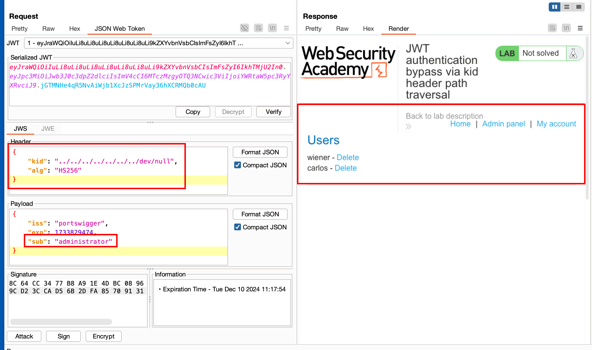
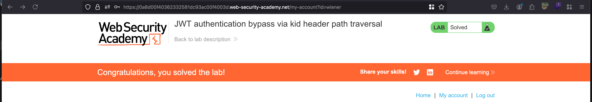

## Objective 

This lab uses a JWT-based mechanism for handling sessions. In order to verify the signature, the server uses the kid parameter in JWT header to fetch the relevant key from its filesystem.

To solve the lab, forge a JWT that gives you access to the admin panel at `/admin`, then delete the user carlos.

You can log in to your own account using the following credentials: `wiener:peter`

## Solution 

Before we start the exploit, we can generate a symmetric key and replace the `n` value with the `nullbyte` value in a `base64` encoded format which `AA==` 

Coming through the repeater tab inside `JWT Tab` , we have to make few changes here like:

- Firstly, we have to change `sub` value to `administrator`
- Then, the `kid` value to `../../../../../../../dev/null` 
- Sign it using the symmetric key which we have created earlier 

And Once after doing everything.. sent the request and as a response, we now got access to admin panel now 

We can just delete the user called `carlos` and that solves the lab 

