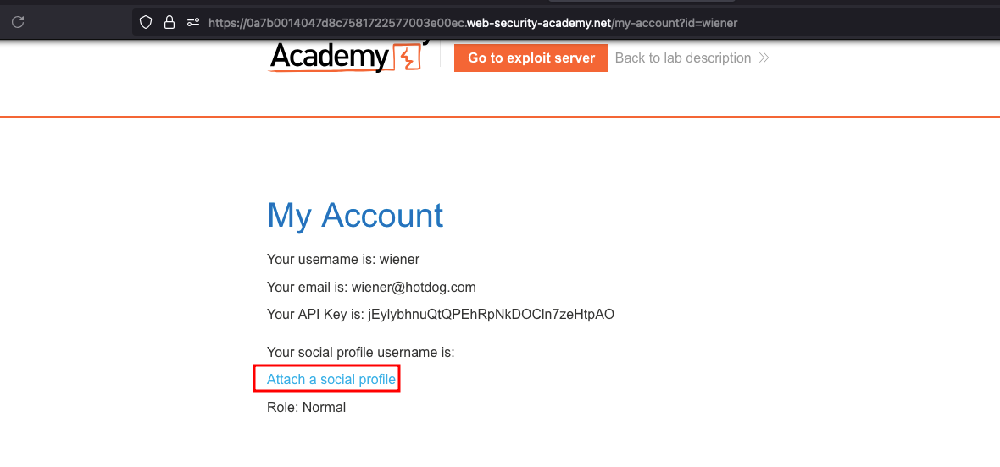
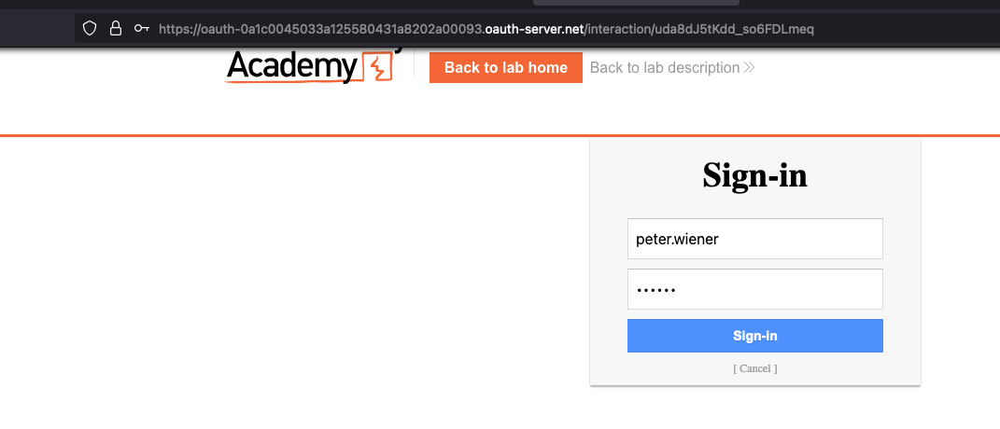
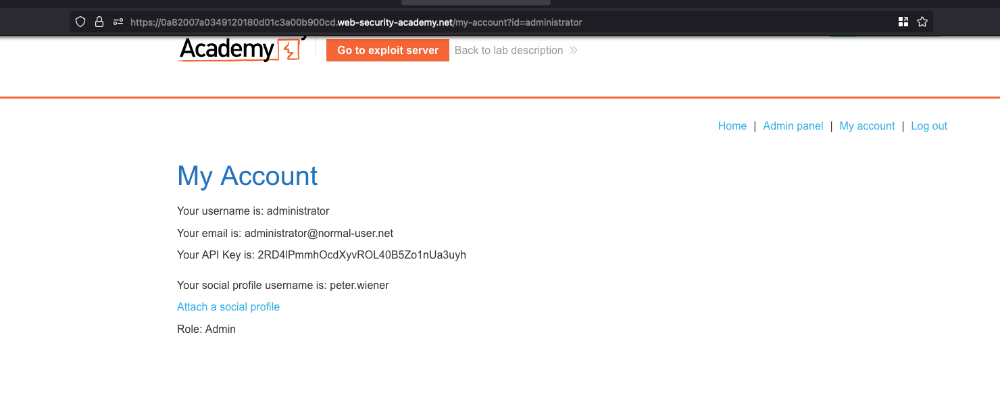
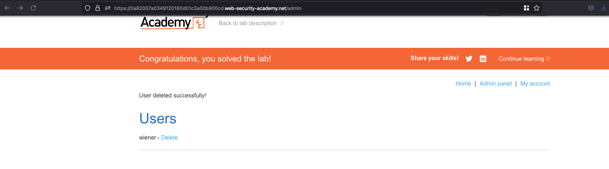

## Objective 

This lab gives you the option to attach a social media profile to your account so that you can log in via OAuth instead of using the normal username and password. Due to the insecure implementation of the OAuth flow by the client application, an attacker can manipulate this functionality to obtain access to other users' accounts.

To solve the lab, use a CSRF attack to attach your own social media profile to the admin user's account on the blog website, then access the admin panel and delete carlos.

The admin user will open anything you send from the exploit server and they always have an active session on the blog website.

You can log in to your own accounts using the following credentials:

- **Blog website account:** wiener:peter
- **Social media profile:** peter.wiener:hotdog

## Solution 

Once after logging as `wiener` user, we have an interesting functionality where you can attach a `Social profile` 



When you can click on `Attach social profile` you will prompted to enter the credentials for social profile which is `peter.wiener` as username and password is `hotdog`



Once after the profile is linked successfully and we may able to see the `peter.wiener` as a social username 

Now once again, we can click on `Attach a social profile` and intercept the request in burp and exactly there will be a second request which goes through a following endpoint 

```sh
https://0a82007a0349120180d01c3a00b900cd.web-security-academy.net/oauth-linking?code=tGwhvPQEt_yWpFoZQmffob66yBkuzcHrMM7qBClXUXe
```

Now in the exploit server, we can place the following payload.. so whenever the admin have interaction and our social profile will get linked to the victim account 

```html
<iframe src="https://0a82007a0349120180d01c3a00b900cd.web-security-academy.net/oauth-linking?code=tGwhvPQEt_yWpFoZQmffob66yBkuzcHrMM7qBClXUXe"></iframe>
```

Now we can just log out and login in again using social profile and we can see that, our social profile got successfully linked to the admin account 



To solve the lab, we can just go into the `Admin panel` and delete the user `carlos`



