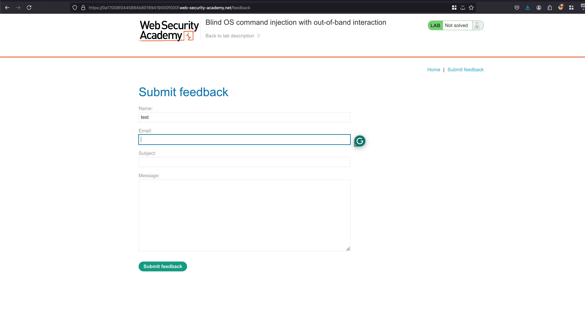
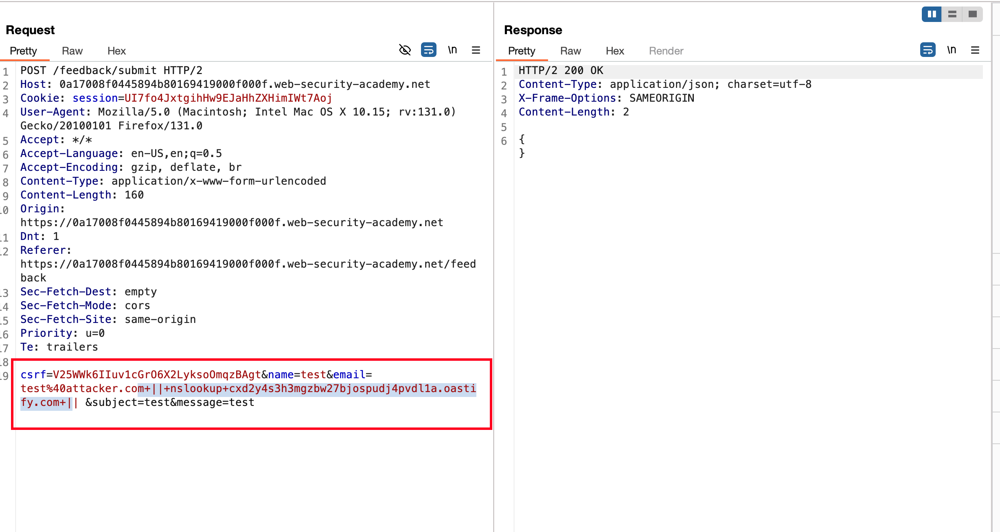
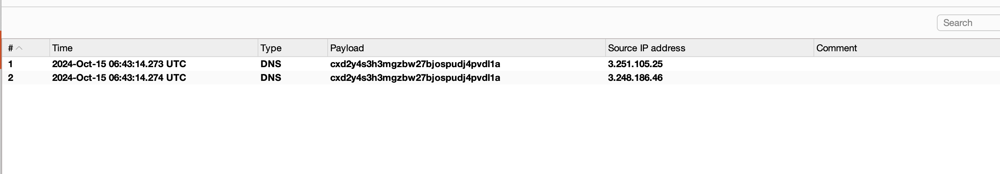

## Objective 

This lab contains a blind OS command injection vulnerability in the feedback function.

The application executes a shell command containing the user-supplied details. The command is executed asynchronously and has no effect on the application's response. It is not possible to redirect output into a location that you can access. However, you can trigger out-of-band interactions with an external domain.

To solve the lab, exploit the blind OS command injection vulnerability to issue a DNS lookup to Burp Collaborator.

## Solution 

Just like the other lab, we have a feedback submission form 

We know that email field is vulnerable to OS command injectiion and in order to solve the lab we need to get the pingback from the server through the collaborator and utilising the following payload `|| nslookup cxd2y4s3h3mgzbw27bjospudj4pvdl1a.oastify.com ||` 

Now place the following payload into the email parameter... url encode, sent the request and response as expected without an error 

Checking the collaborator, we got a DNS pingback 

As mentioned in lab description, We got the DNS pingback and that solves the lab 