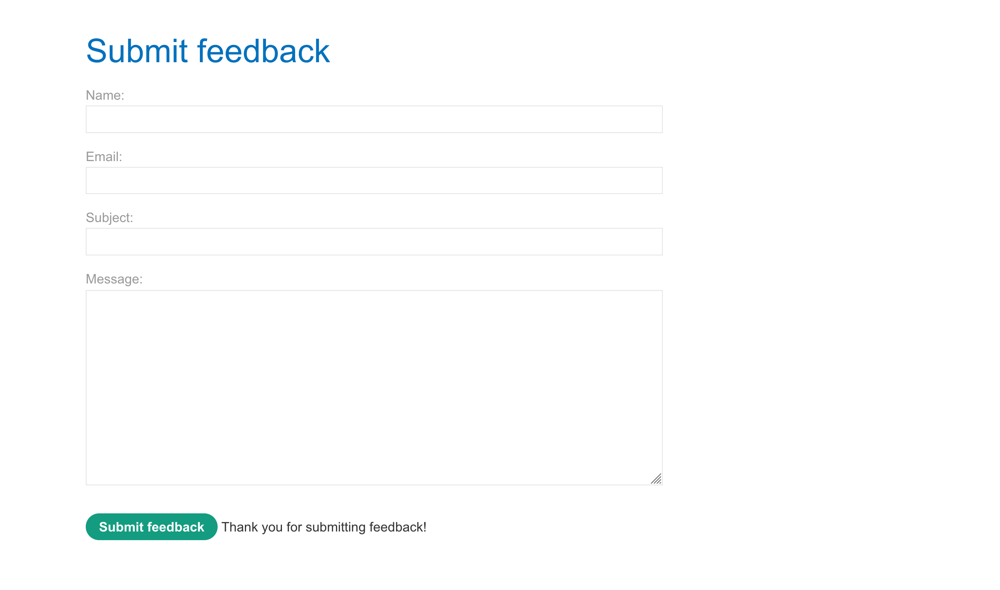
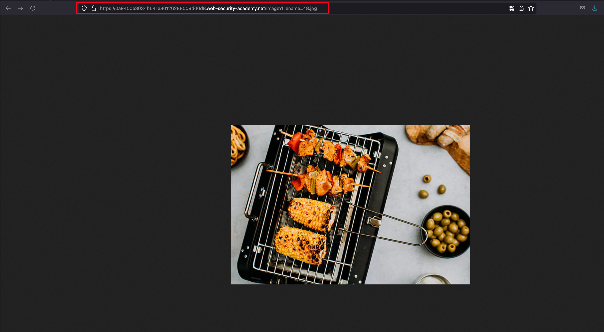
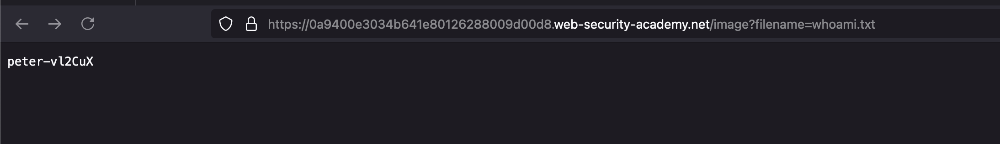

## Objective 

This lab contains a blind OS command injection vulnerability in the feedback function.

The application executes a shell command containing the user-supplied details. The output from the command is not returned in the response. However, you can use output redirection to capture the output from the command. There is a writable folder at:
`/var/www/images/`

The application serves the images for the product catalog from this location. You can redirect the output from the injected command to a file in this folder, and then use the image loading URL to retrieve the contents of the file.

To solve the lab, execute the whoami command and retrieve the output. 

## Solution 

Just like the last lab, we have the same feedback submission form which is obviously vulnerable to the OS command injection 

Fill up the submission form and intercept the request.. now think about the last time on what we did.. we made a 10 seconds delay which is our objective to solve.. but here payload looks like the same but instead we need to redirect the output to a director called `/var/www/images` where the images are stored for webserver and you can have it look by opening any image on the application in the new tab 

In the feedback submission on the `email` field, add the following payload `|| whoami > /var/www/images/whoami.txt ||` and send the request.. now response looks good.. go back to the image which we opened and replace the image name with `whoami.txt` you will see the command output of `whoami` and that solves the lab 

