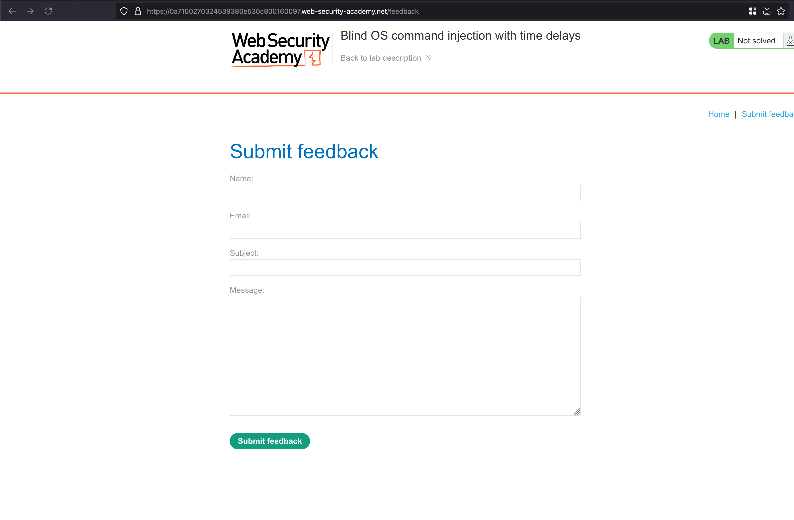
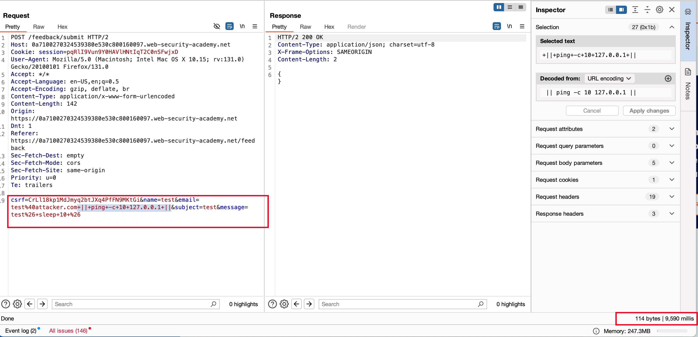

## Objective 

This lab contains a blind OS command injection vulnerability in the feedback function.

The application executes a shell command containing the user-supplied details. The output from the command is not returned in the response.

To solve the lab, exploit the blind OS command injection vulnerability to cause a 10 second delay.

## Solution 

Last OS Command injection we saw there was some sort of error we passed through the payload through a request and response showed us what kind of error and command execution.. But in this lab case, we didn't find anything interesting but there is `Submit feedback` functionality 

 

While filling the feedback form, add the following payload `|| ping -c 10 127.0.0.1 ||` in the email field and urlencoded it and then sent the request.. Now the ping command will send 10 packets to a localhost address and if the localhost doesn't pingback in those 10 packets which we sent.. Causes the 10 sec delay in the response 

As expected, there is a `10 sec` delay in the response and that solves the lab 

 