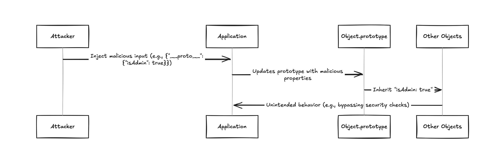

## Understanding Prototypes

Prototypes in JavaScript are like a blueprint. Every object gets default properties and behavior from this blueprint.

  

```js
const car = {}; // Creating a Object 
// The object can already do things like car.toString() because it inherits this ability from the prototype (Object.prototype).
```

**Prototype pollution** is a JavaScript security issue where an attacker can add or change properties in a default object (called a prototype). This can break an application or let the attacker do bad things like bypassing security or gaining extra privileges.
 

### Example


Let’s imagine JavaScript objects are like cookie cutters. When you create a cookie (object), it takes the default shape from the cutter (prototype). If someone secretly alters the cutter, every new cookie inherits the changes.

  

```js
const user = JSON.parse('{"__proto__": {"isAdmin": true}}');
console.log(user.isAdmin); // Output: true (unintended!)
```

  

- An attacker provides malicious input: `{"__proto__": {"isAdmin": true}}`.
- When this input is parsed, JavaScript updates the `Object.prototype` with `isAdmin: true`.
- Now, any object created afterward will inherit `isAdmin: true`, whether or not it was meant to have it.
 

## Flow diagram of above the example




  

## Important points about **__proto__**


- `__proto__` is a built-in property that points to an object’s prototype, enabling objects to inherit properties and methods.
- Writing to `__proto__` changes the prototype (or blueprint) of an object and indirectly affects all objects inheriting from it
- The key `__proto__` is like a secret backdoor in JavaScript that allows changing the prototype of any object.
- Properties added via `__proto__` are inherited by objects, which can override or introduce behaviors unexpectedly.
- Functions like `Object.assign()` or recursive merging can unintentionally process `__proto__` if input is not sanitized.
- Parsers (like `JSON.parse`) treat `__proto__` as a regular key, allowing attackers to embed it in JSON data for pollution.
- `__proto__` is typically non-enumerable, meaning it doesn’t appear in loops, making its presence harder to detect.