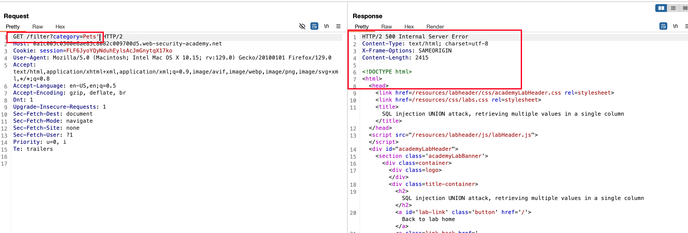
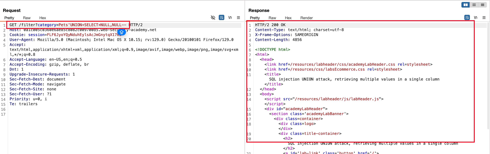
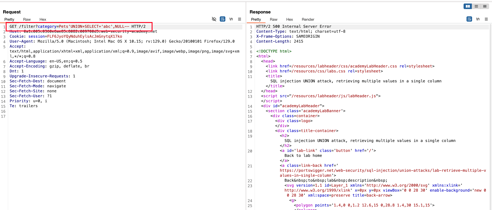
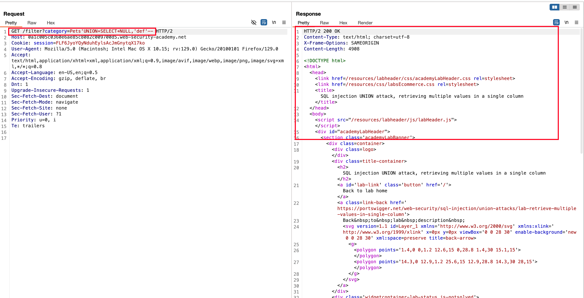
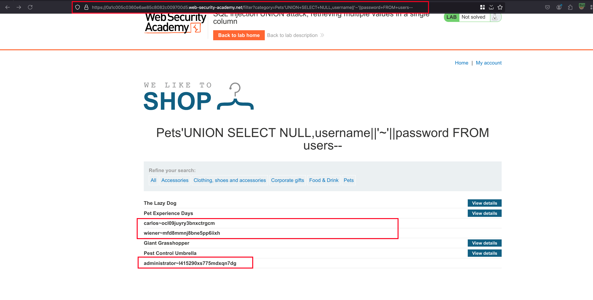
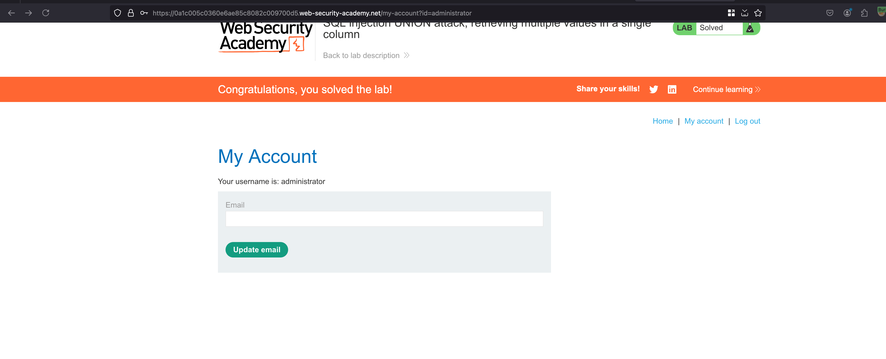

## Objective 

This lab contains a SQL injection vulnerability in the product category filter. The results from the query are returned in the application's response so you can use a UNION attack to retrieve data from other tables.

The database contains a different table called users, with columns called username and password.

To solve the lab, perform a SQL injection UNION attack that retrieves all usernames and passwords, and use the information to log in as the administrator user.

## Solution

Same like other challenges, the product category filter is vulnerable to SQL injection 

Again enumerating on how many number of columns exists and we found there are two columns 

Next up, we need to check on what columns we have control.. Firstly we tried on first column by replacing the `NULL` value with a simple `abc` and resulted in status code of `500` meaning we don't have control over that column 

Now again the same method on the second column by replacing `NULL` with `def` string and it worked... Now we know that we have control over the second column 

With the following payload `'UNION+SELECT+NULL,username||'~'||password+FROM+users--` we were able to retrieve teh credentials from users database 

Here we have,

`||'~'||` concatenates the username and password in a single column using `||` and it is separated using `~`

Copy the admin related credentials, login and lab is solved 

