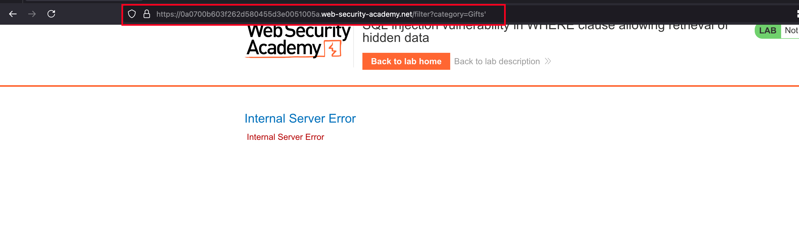
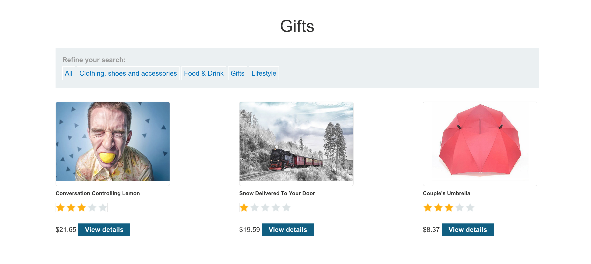
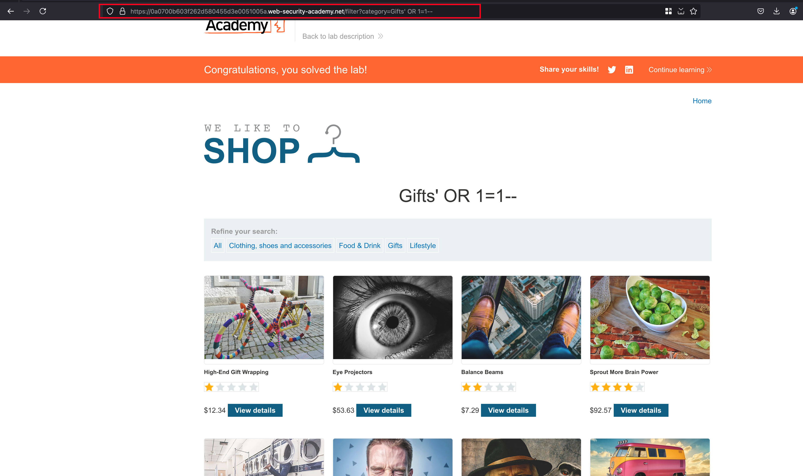

## Objective 

This lab contains a SQL injection vulnerability in the product category filter. When the user selects a category, the application carries out a SQL query like the following:

```sql
SELECT * FROM products WHERE category = 'Gifts' AND released = 1
```

To solve the lab, perform a SQL injection attack that causes the application to display one or more unreleased products. 

## Solution 

Same like the rest other SQL injection labs where we solved and this lab is also vulnerable to SQL injection through a product category filter when we pass `'` through `category` parameter resulted in `500` that's a sign right 



Viewing the gift filter shows only 3 product and our endgoal is to make it show unreleased products as well 



With the following payload `' OR 1=1--` where this payload will initially break out of the SQL query and then checks on true or false statement here in our its true right because of 1=1 and once the request is sent, we will able to see some unreleased products.. 

And the lab is solved 

