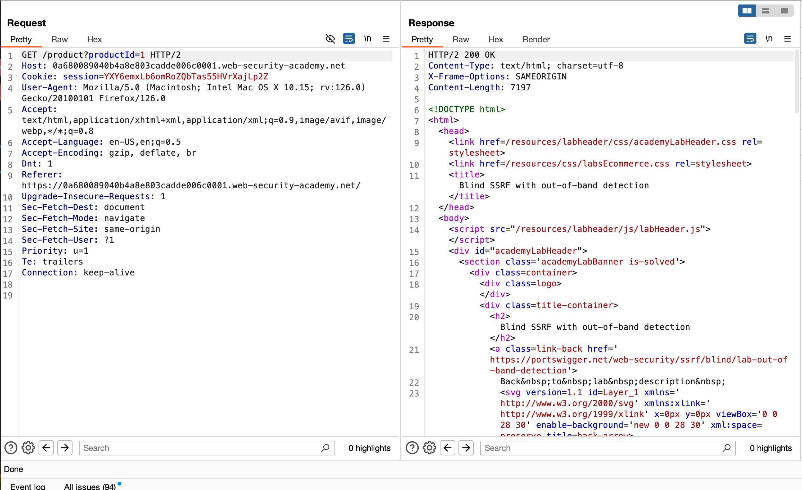
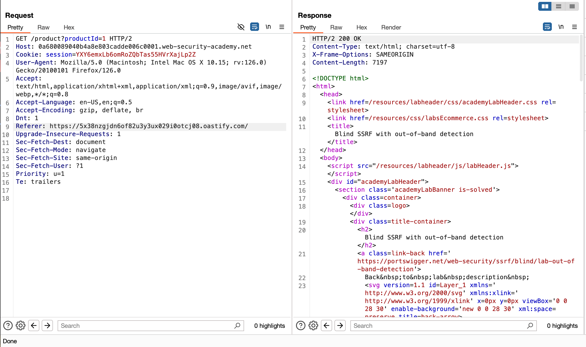
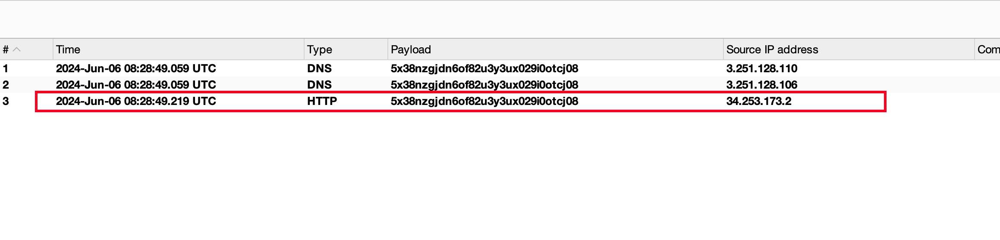
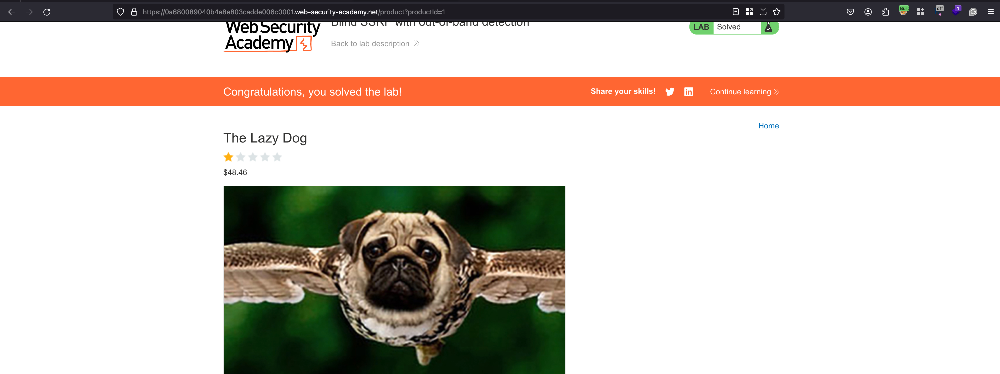

## Introduction 

This site uses analytics software which fetches the URL specified in the Referer header when a product page is loaded.

To solve the lab, use this functionality to cause an HTTP request to the public Burp Collaborator server. 

## Solution 

Once after spinning the lab, you can go, visit any products available on this website and intercept the request 

Replace the actual value in `Referrer:` header with the collaborator URL and send the request 

Well, the request passes and responds with a status code of 200 

Looking into the collaborator, we have received HTTP pingback which is our endgoal to make it 

Once we got HTTP pingback and our lab is solved as well 

