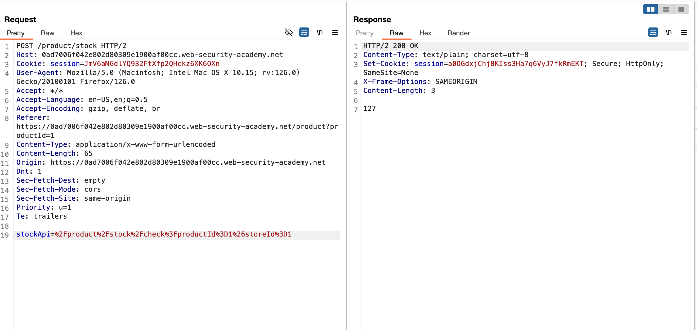
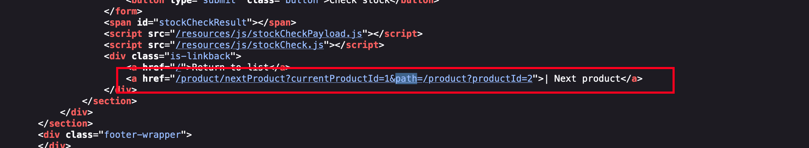
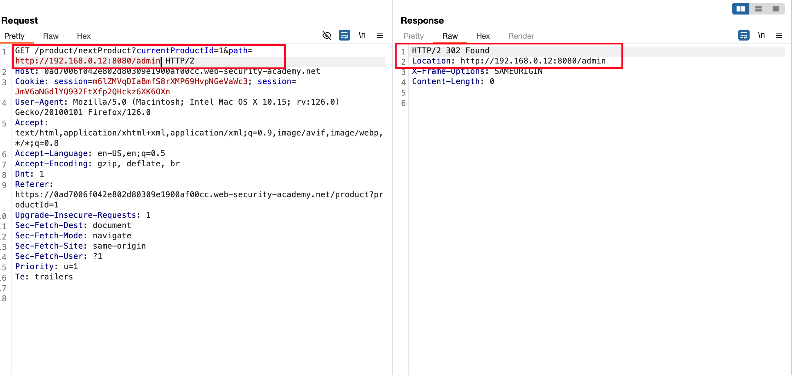
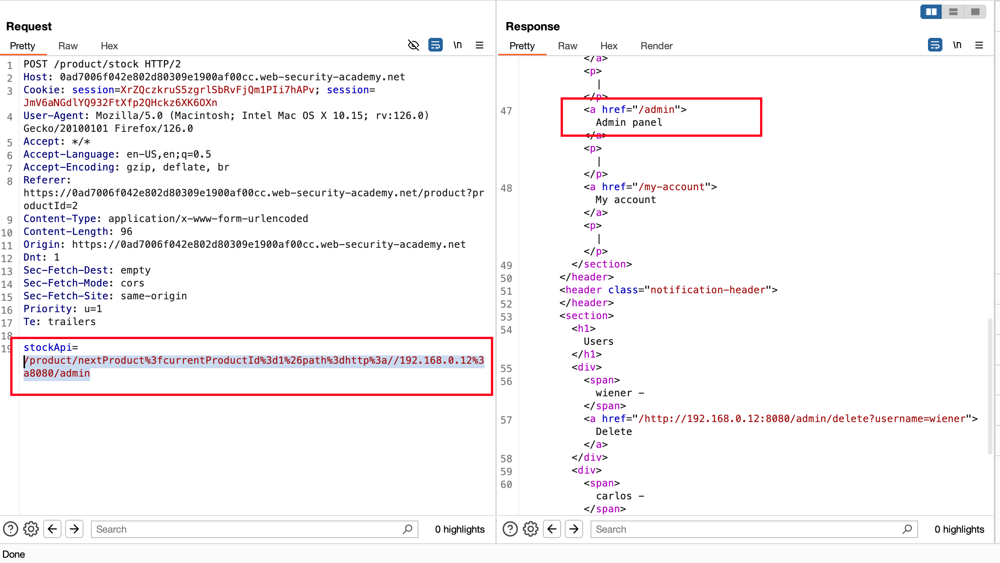
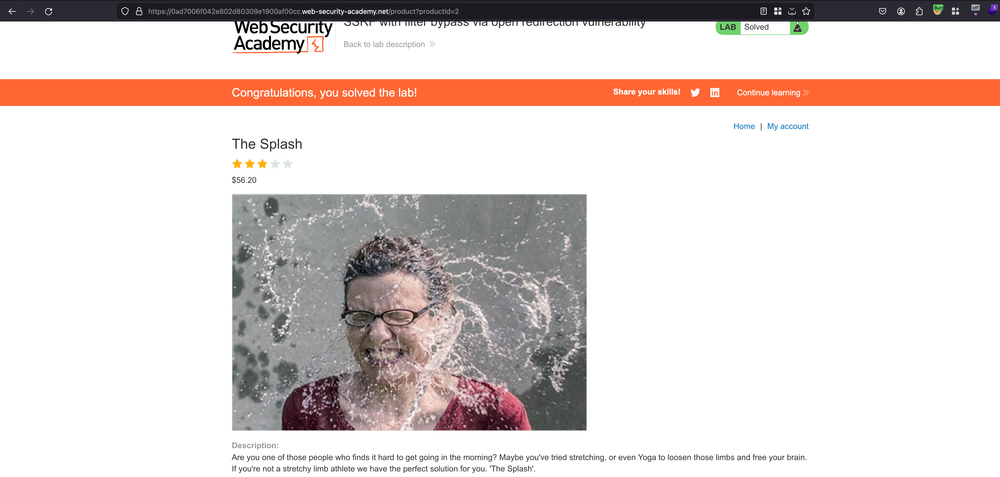

## Introduction

This lab has a stock check feature which fetches data from an internal system.

To solve the lab, change the stock check URL to access the admin interface at http://192.168.0.12:8080/admin and delete the user carlos.

The stock checker has been restricted to only access the local application, so you will need to find an open redirect affecting the application first. 

## Solution

In this challenge also, we have the same functionality but it is being called internally to check the stock units

if you look deep dive into the view-source,  we have a new parameter called `path` which is also reached out in other ways by clicking on next product hyperlink

Now In the intercepted request, add the `path` parameter and as an value called `http://192.168.0.12:8080/admin` to access the admin panel which is mentioned in the lab objective and send the request 

After sending the request, we found some sort of kind of open redirection issue here 

Now, take the following path from where we found the redirection issue and replace the copied path under `stockApi` parameter and sent the request and now we were able to access the admin panel 

Now again send the following request `/admin/delete?username=carlos` where as user called carlos will be deleted and lab will be solved 

