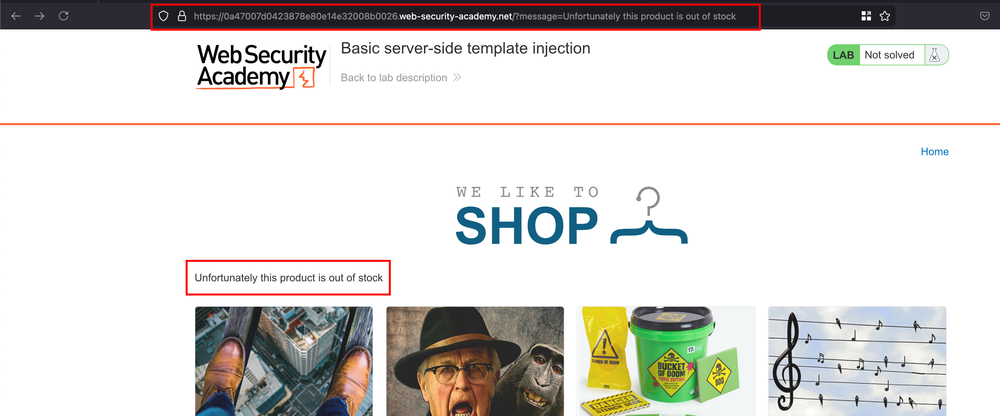
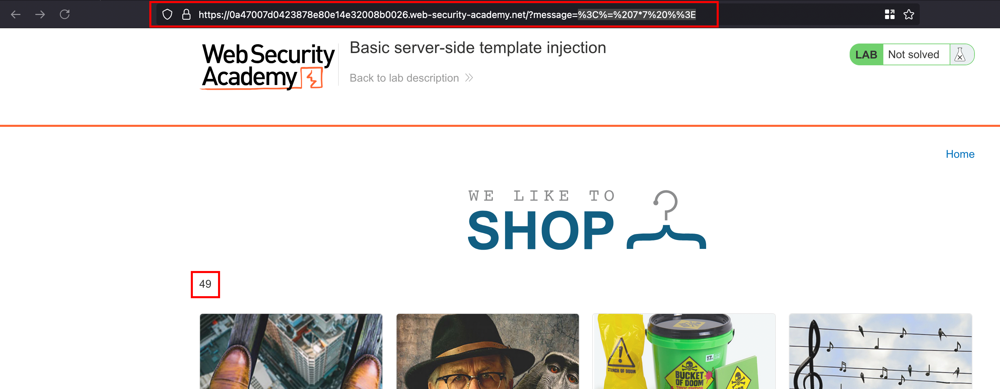
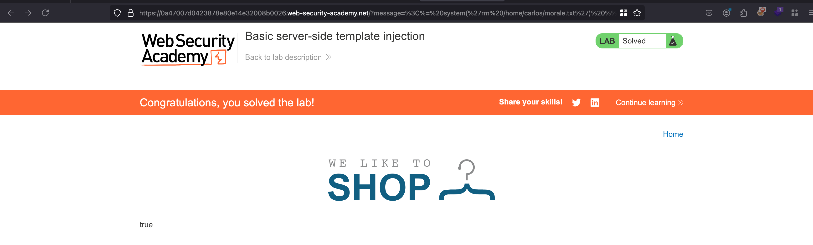

## Objective 

This lab is vulnerable to server-side template injection due to the unsafe construction of an ERB template.

To solve the lab, review the ERB documentation to find out how to execute arbitrary code, then delete the morale.txt file from Carlos's home directory.

## Solution 

Once after spinning the lab, if we load any product and it will say that `Unfortunately this product is out of stock` through `message` parameter which is kinda get rendered here 

Through the `message` parameter, entered the basic payload for SSTI in erb template `<%= 7*7 %>` which will actually rendered as `49` in the response meaning the payload which we gave through the `message` parameter got executed which `7 x 7 = 49` actually rendered in the response

Now in the same message parameter we can enter the following payload like `<%= system('rm /home/carlos/morale.txt') %>` which will delete the particular file as mentioned in the lab objective and that solves the lab 

